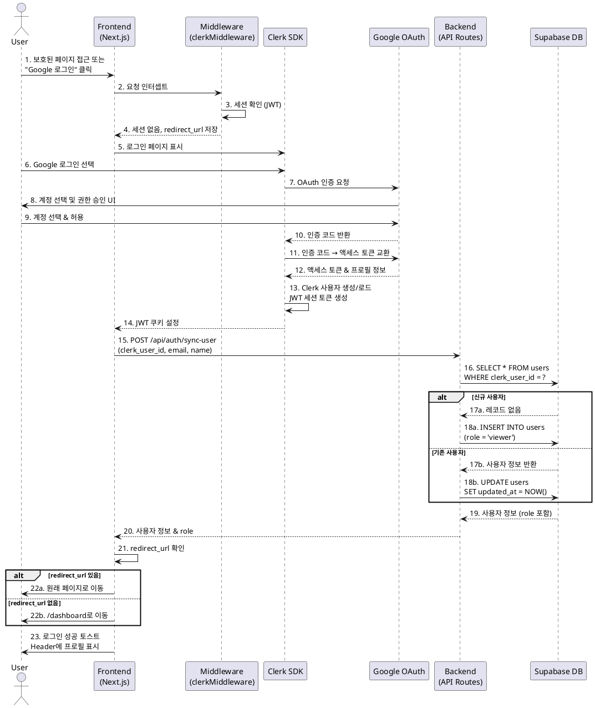
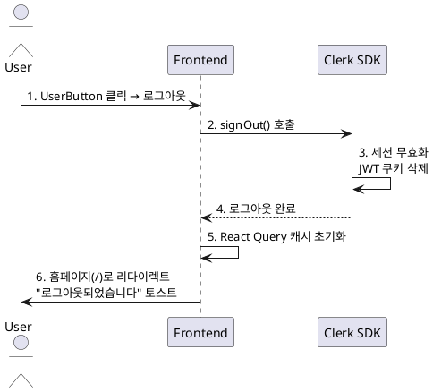

# 유스케이스: 사용자 인증 (Google OAuth with Clerk)

**유스케이스 ID**: UC-001
**버전**: 1.0
**작성일**: 2025-11-02
**프로젝트**: University Dashboard - Vibe Dashboard 2

---

## 1. 개요

### 1.1 목적
대학교 데이터 시각화 대시보드에 접근하는 사용자의 신원을 확인하고, 역할 기반 접근 제어(RBAC)를 통해 안전하게 시스템을 이용할 수 있도록 인증 및 세션 관리를 제공합니다.

### 1.2 범위
- Google OAuth를 통한 로그인/로그아웃
- 사용자 세션 생성 및 관리
- 세션 만료 처리
- 역할 기반 접근 제어 (관리자/이용자)
- Clerk와 Supabase 간 사용자 정보 동기화

**제외 사항**:
- 이메일/패스워드 직접 로그인 (MVP 범위 외)
- 소셜 로그인 확장 (Apple, GitHub 등)
- 다단계 인증(MFA)

### 1.3 액터
- **주요 액터**: 대학교 구성원 (교수진, 경영진, 행정직원)
- **부 액터**:
  - Clerk 인증 서비스
  - Google OAuth Provider
  - Supabase Database

---

## 2. 선행 조건

- 사용자가 유효한 Google 계정을 보유하고 있어야 함
- Clerk 프로젝트가 Google OAuth Provider로 설정되어 있어야 함
- Supabase `users` 테이블이 생성되어 있어야 함
- 네트워크 연결이 정상이어야 함

---

## 3. 참여 컴포넌트

### 프론트엔드
- **홈페이지 (/)**: Google 로그인 버튼 제공
- **Middleware (`middleware.ts`)**: 모든 요청의 인증 상태 확인
- **Layout (`app/layout.tsx`)**: ClerkProvider 래핑, 사용자 UI 표시

### 백엔드
- **Clerk SDK**:
  - `@clerk/nextjs` - 클라이언트 컴포넌트
  - `@clerk/nextjs/server` - 서버 컴포넌트, API Routes
- **Next.js API Routes**: 사용자 동기화 및 역할 검증
- **Supabase Client**: 사용자 정보 CRUD

### 외부 서비스
- **Clerk**: 인증 서비스 제공, 세션 관리
- **Google OAuth**: 사용자 인증 및 프로필 정보 제공

---

## 4. 기본 플로우: Google 로그인

### 4.1 단계별 흐름

**UC-001-F1: Google 로그인 성공**

#### Step 1: 로그인 시작
- **사용자**: 홈페이지(/) 또는 보호된 페이지 접근
- **입력**: "Google로 로그인" 버튼 클릭
- **처리**:
  - 보호된 페이지 접근 시: `middleware.ts`가 세션 확인
  - 세션 없음: redirect_url 파라미터에 원래 URL 저장
  - Clerk 로그인 페이지로 리다이렉트
- **출력**: Clerk 제공 로그인 UI 표시

#### Step 2: Google OAuth 인증
- **사용자**: Google 로그인 페이지에서 계정 선택
- **입력**: Google 계정 및 비밀번호
- **처리**:
  1. Clerk가 Google OAuth URL 생성
  2. Google 인증 서버로 리다이렉트
  3. 사용자 Google 계정 인증
  4. 권한 승인 화면 (프로필, 이메일 접근)
  5. 사용자가 "허용" 클릭
  6. Google이 인증 코드 발급
- **출력**: 인증 코드와 함께 Clerk Callback URL로 리다이렉트

#### Step 3: 세션 생성
- **Clerk**:
  - **입력**: Google 인증 코드
  - **처리**:
    1. 인증 코드를 Google 액세스 토큰으로 교환
    2. Google API에서 사용자 프로필 조회 (email, name, profile_image_url)
    3. Clerk 내부에 사용자 계정 생성(신규) 또는 로드(기존)
    4. JWT 세션 토큰 생성
    5. HttpOnly, Secure 쿠키로 JWT 저장 (유효기간: 7일)
  - **출력**:
    - 세션 쿠키 설정
    - `clerk_user_id` 생성

#### Step 4: 사용자 동기화 (Supabase)
- **Application**:
  - **입력**: Clerk 사용자 정보 (clerk_user_id, email, name)
  - **처리**:
    1. Supabase `users` 테이블에서 `clerk_user_id`로 검색
    2. 신규 사용자인 경우:
       ```sql
       INSERT INTO users (clerk_user_id, email, name, role)
       VALUES ('user_2abc123', 'user@university.edu', '홍길동', 'viewer');
       ```
    3. 기존 사용자인 경우:
       ```sql
       UPDATE users SET updated_at = NOW()
       WHERE clerk_user_id = 'user_2abc123';
       ```
  - **출력**:
    - Supabase `users` 테이블 업데이트
    - 사용자 역할(role) 정보 확인

#### Step 5: 리다이렉트
- **Application**:
  - **입력**: redirect_url 파라미터
  - **처리**:
    1. redirect_url 값 확인
    2. 값이 있는 경우: 원래 페이지로 리다이렉트
    3. 값이 없는 경우: 메인 대시보드(/dashboard)로 리다이렉트
  - **출력**:
    - 로그인 성공 토스트 메시지
    - 메인 대시보드 또는 원래 페이지 표시
    - Header에 사용자 프로필 (아바타, 이름) 표시

### 4.2 시퀀스 다이어그램



---

## 5. 대안 플로우

### 5.1 Remember Me (로그인 유지)

**시작 조건**: 로그인 시 "로그인 유지" 체크박스 선택

**단계**:
1. 사용자가 "로그인 유지" 옵션 활성화
2. Clerk가 세션 유효기간을 30일로 설정 (기본 7일 대신)
3. JWT 쿠키 max-age를 30일로 설정

**결과**: 30일 동안 자동 로그인 유지

---

## 6. 예외 플로우

### 6.1 Google 인증 실패

**발생 조건**:
- 사용자가 Google 권한 승인 거부
- Google 계정 문제 (잠김, 삭제됨)
- 네트워크 오류

**처리 방법**:
1. Clerk가 에러 감지
2. 에러 타입 분류:
   - `oauth_access_denied`: "Google 인증을 거부하셨습니다"
   - `network_error`: "네트워크 연결을 확인해주세요"
3. 에러 모달 표시
4. "재시도" 또는 "취소" 버튼 제공

**에러 코드**: 401 Unauthorized

**사용자 메시지**: "Google 로그인에 실패했습니다. [에러 원인]\n다시 시도하시겠습니까?"

---

### 6.2 세션 만료

**발생 조건**:
- JWT 토큰 유효기간 초과 (7일 또는 30일)
- 장시간 비활성 상태

**처리 방법**:
1. API 요청 시 Middleware에서 JWT 검증 실패 감지
2. 현재 페이지 URL을 redirect_url 파라미터로 저장
3. 세션 쿠키 삭제
4. 로그인 페이지로 리다이렉트

**에러 코드**: 401 Unauthorized

**사용자 메시지**: "세션이 만료되었습니다. 다시 로그인해주세요."

---

### 6.3 권한 없음 (403 Forbidden)

**발생 조건**:
- 일반 사용자(viewer)가 관리자 전용 페이지(/data/*) 접근
- role 정보 불일치

**처리 방법**:
1. Middleware 또는 API Route에서 사용자 role 확인
2. 필요 권한과 불일치 시 403 에러 페이지 렌더링
3. 에러 페이지에 "대시보드로 돌아가기" 버튼 제공

**에러 코드**: 403 Forbidden

**사용자 메시지**:
```
접근 권한이 없습니다

이 페이지는 관리자만 접근할 수 있습니다.
관리자 권한이 필요한 경우 시스템 관리자에게 문의하세요.

[대시보드로 돌아가기] [로그아웃]
```

---

### 6.4 Supabase 동기화 실패

**발생 조건**:
- Supabase 연결 오류
- DB 제약조건 위반

**처리 방법**:
1. 에러 로그 기록 (Sentry, Vercel Logs)
2. 사용자에게는 정상 로그인된 것처럼 처리 (Clerk 세션은 유효)
3. 백그라운드에서 재시도 (exponential backoff)
4. 관리자 알림 전송

**에러 코드**: 500 Internal Server Error

**사용자 메시지**: "일시적인 오류가 발생했습니다. 잠시 후 다시 시도해주세요."

---

## 7. 로그아웃 플로우

### 7.1 기본 플로우

**단계**:
1. **사용자**: Header의 UserButton 클릭 → "로그아웃" 선택
2. **Clerk**:
   - 세션 무효화
   - JWT 쿠키 삭제
3. **Application**:
   - React Query 캐시 초기화
   - 홈페이지(/)로 리다이렉트
4. **출력**: "로그아웃되었습니다" 토스트 메시지

### 7.2 시퀀스 다이어그램



---

## 8. 세션 관리

### 8.1 세션 갱신

**자동 갱신 조건**:
- JWT 토큰 만료 24시간 이내
- 사용자가 활성 상태 (페이지 이동, API 요청)

**처리 방법**:
1. Middleware에서 JWT 만료 임박 감지
2. Clerk가 자동으로 새로운 JWT 발급
3. 쿠키 갱신 (사용자 인지 없음)

### 8.2 동시 로그인 관리

**정책**: 여러 디바이스에서 동시 로그인 허용
- 각 디바이스마다 독립적인 세션 유지
- 한 디바이스에서 로그아웃 시 다른 디바이스 세션에 영향 없음

---

## 9. 역할 기반 접근 제어 (RBAC)

### 9.1 역할 정의

| 역할 | 권한 | 접근 가능 페이지 |
|------|------|-----------------|
| **viewer** (기본) | 대시보드 조회, 데이터 필터링, 리포트 다운로드 | `/dashboard/*` |
| **administrator** | viewer 권한 + 데이터 업로드, DB 적재, 사용자 관리 | `/dashboard/*`, `/data/*` |

### 9.2 권한 확인 방식

#### 클라이언트 사이드 (페이지 렌더링)
```typescript
// 예시 코드 (구현 참고용)
import { auth } from '@clerk/nextjs/server';
import { redirect } from 'next/navigation';

export default async function DataUploadPage() {
  const { userId } = await auth();

  // 인증 확인
  if (!userId) redirect('/sign-in');

  // 권한 확인 (Supabase 조회)
  const user = await getUserRole(userId);
  if (user?.role !== 'administrator') {
    redirect('/403'); // 권한 없음 페이지
  }

  return <DataUploadUI />;
}
```

#### 서버 사이드 (API Routes)
```typescript
// 예시 코드 (구현 참고용)
import { auth } from '@clerk/nextjs/server';

export async function POST(request: Request) {
  const { userId } = await auth();

  if (!userId) {
    return new Response('Unauthorized', { status: 401 });
  }

  const user = await getUserRole(userId);
  if (user?.role !== 'administrator') {
    return new Response('Forbidden', { status: 403 });
  }

  // 권한 있는 경우 로직 실행
  // ...
}
```

---

## 10. 후행 조건

### 10.1 성공 시

**데이터베이스 변경**:
- `users` 테이블에 신규 사용자 INSERT 또는 기존 사용자 UPDATE
- `updated_at` 컬럼 갱신

**시스템 상태**:
- 사용자 세션 활성 상태 (JWT 쿠키 저장)
- React Query 캐시 초기화 (새 사용자 정보 로드)
- Header에 사용자 프로필 표시

**외부 시스템**:
- Clerk에 세션 기록 저장
- Google Analytics 로그인 이벤트 전송

### 10.2 실패 시

**데이터 롤백**:
- 부분 실패 시(Supabase 동기화 실패) Clerk 세션은 유지
- 전체 실패 시 세션 생성 안 됨

**시스템 상태**:
- 사용자 비인증 상태 유지
- 로그인 페이지 표시

---

## 11. 비기능 요구사항

### 11.1 성능
- 로그인 완료까지 총 소요 시간: < 5초 (네트워크 정상 시)
- 세션 검증 시간: < 100ms (Middleware)

### 11.2 보안
- **HTTPS 필수**: TLS 1.3
- **JWT 쿠키 보안**:
  - HttpOnly: true (XSS 방지)
  - Secure: true (HTTPS only)
  - SameSite: Lax (CSRF 방지)
- **세션 토큰 변조 방지**: Clerk 자동 검증
- **환경 변수 보호**:
  - `CLERK_SECRET_KEY`: 서버 사이드 전용
  - `.env.local`에 저장, Git 제외

### 11.3 가용성
- Clerk 서비스 SLA: 99.9% uptime
- 세션 자동 갱신으로 사용자 경험 중단 최소화

### 11.4 사용성
- 원클릭 로그인 (Google 계정 선택만)
- 세션 만료 시 명확한 메시지 및 재로그인 유도
- 모바일 반응형 지원

---

## 12. UI/UX 요구사항

### 12.1 로그인 화면 (홈페이지)

**비로그인 상태**:
```
┌─────────────────────────────────────┐
│  University Dashboard Logo          │
│                                     │
│  대학교 데이터를 한눈에             │
│                                     │
│  [Google로 로그인]                  │
└─────────────────────────────────────┘
```

**로그인 상태**:
```
┌─────────────────────────────────────┐
│ Logo    [대시보드] [데이터관리]  [👤▼]│
└─────────────────────────────────────┘
```

### 12.2 사용자 메뉴 (UserButton 드롭다운)

```
┌─────────────────────┐
│ 👤 홍길동           │
│ user@university.edu │
├─────────────────────┤
│ 프로필 설정         │
│ 로그아웃            │
└─────────────────────┘
```

---

## 13. Edge Cases & Business Rules

### 13.1 Edge Cases

| 상황 | 처리 방법 |
|------|----------|
| Google 계정 없음 | Google 계정 생성 페이지 안내 링크 제공 |
| 첫 로그인 사용자 | 온보딩 튜토리얼 모달 표시 (스킵 가능) |
| 이메일 미인증 Google 계정 | Clerk에서 자동 허용, 경고 메시지 표시 |
| 동일 이메일, 다른 OAuth Provider | Clerk가 자동으로 계정 병합 제안 |
| 토큰 변조 시도 | 즉시 세션 무효화 및 로그아웃, 보안 이벤트 로그 |
| 탭 간 세션 동기화 | BroadcastChannel API 사용 (한 탭에서 로그아웃 시 모든 탭 로그아웃) |

### 13.2 Business Rules

**BR-001: 역할 자동 할당**
- 신규 사용자는 기본적으로 `viewer` 역할 부여
- 관리자 역할은 수동으로 데이터베이스에서 변경 필요

**BR-002: 세션 유효기간**
- 기본: 7일
- Remember Me 선택 시: 30일
- 관리자 계정: 무관 (동일 정책)

**BR-003: 비활성 세션 정책**
- 세션 만료 전까지는 비활성 상태와 무관하게 유지
- 보안상 필요 시 관리자가 수동으로 세션 무효화 가능

**BR-004: 중복 계정 방지**
- 이메일 기준으로 중복 방지
- Clerk가 자동으로 관리

---

## 14. 테스트 시나리오

### 14.1 성공 케이스

| TC ID | 입력 | 기대 결과 |
|-------|------|----------|
| TC-001-01 | 유효한 Google 계정으로 로그인 | 세션 생성, /dashboard 리다이렉트, 사용자 프로필 표시 |
| TC-001-02 | Remember Me 체크 후 로그인 | 세션 유효기간 30일, 쿠키 max-age 확인 |
| TC-001-03 | 로그인 후 보호된 페이지 접근 | 페이지 정상 표시 |
| TC-001-04 | 로그아웃 클릭 | 세션 삭제, 홈페이지 이동, 토스트 메시지 |

### 14.2 실패 케이스

| TC ID | 입력 | 기대 결과 |
|-------|------|----------|
| TC-001-05 | Google 권한 거부 | 에러 모달, "재시도" 버튼 제공 |
| TC-001-06 | 세션 만료 후 API 요청 | 401 에러, 로그인 페이지 리다이렉트 |
| TC-001-07 | viewer 계정으로 /data/upload 접근 | 403 에러 페이지 표시 |
| TC-001-08 | 네트워크 오류 시 로그인 | "네트워크 연결 확인" 메시지, 재시도 옵션 |
| TC-001-09 | Supabase 연결 실패 | Clerk 세션은 유지, 백그라운드 재시도 |

---

## 15. 관련 유스케이스

- **후행 유스케이스**:
  - UC-002: 메인 대시보드 조회
  - UC-006: CSV 파일 업로드 (관리자 전용)
- **연관 유스케이스**:
  - UC-XXX: 사용자 프로필 관리 (향후 구현)
  - UC-XXX: 역할 변경 (관리자 기능, 향후 구현)

---

## 16. 변경 이력

| 버전 | 날짜 | 작성자 | 변경 내용 |
|------|------|--------|-----------|
| 1.0  | 2025-11-02 | AI Assistant | 초기 작성 |

---

## 부록

### A. 용어 정의

- **OAuth (Open Authorization)**: 사용자 인증 정보를 직접 관리하지 않고 제3자 서비스(Google)를 통해 인증하는 프로토콜
- **JWT (JSON Web Token)**: 사용자 세션 정보를 담은 암호화된 토큰
- **RBAC (Role-Based Access Control)**: 사용자 역할에 따라 접근 권한을 제어하는 방식
- **Clerk**: Next.js와 통합된 인증 서비스 플랫폼
- **HttpOnly Cookie**: JavaScript로 접근할 수 없는 쿠키 (XSS 공격 방지)

### B. 참고 자료

- [Clerk Next.js Documentation](https://clerk.com/docs/quickstarts/nextjs)
- [Google OAuth 2.0 Documentation](https://developers.google.com/identity/protocols/oauth2)
- [PRD: FR-AUTH-001, FR-AUTH-002, FR-AUTH-003](/docs/prd.md)
- [Userflow: 2. 인증 플로우](/docs/userflow.md)
- [Database: users 테이블 스키마](/docs/database.md)
- [Clerk Integration Guide](/docs/external/clerk.md)

---

**문서 종료**
