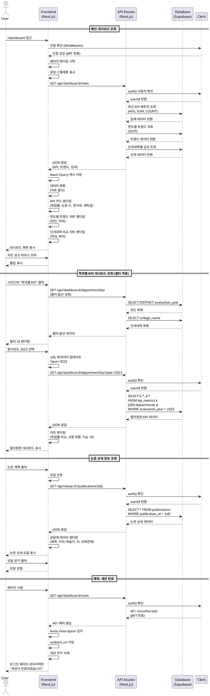

# 유스케이스: 대시보드 조회 및 데이터 시각화

**유스케이스 ID**: UC-002
**버전**: 1.0
**작성일**: 2025-11-02
**우선순위**: High

---

## 1. 개요

### 1.1 목적
사용자가 대학의 핵심 성과 지표(KPI)를 시각적으로 조회하고 분석할 수 있도록 다양한 대시보드 페이지를 제공합니다. 이를 통해 학과별, 연도별, 단과대학별 성과를 직관적으로 파악하고, 데이터 기반 의사결정을 지원합니다.

### 1.2 범위
본 유스케이스는 다음 기능을 포함합니다:
- 메인 대시보드 조회 (전체 KPI)
- 학과별 KPI 대시보드 조회
- 논문 게재 현황 조회
- 연구과제 관리 현황 조회
- 예산 집행 현황 조회
- 학생 현황 조회
- 필터링 및 정렬 기능
- 차트 렌더링 및 상호작용

제외 사항:
- 데이터 파일 업로드 및 DB 적재 (UC-004)
- 데이터 수정 및 삭제 기능

### 1.3 액터
- **주요 액터**: 인증된 사용자 (일반 이용자, 관리자, 교수진)
- **부 액터**: Supabase 데이터베이스, Clerk 인증 서비스

---

## 2. 선행 조건

1. 사용자가 Google 계정으로 로그인되어 있어야 함 (Clerk 인증 완료)
2. Supabase 데이터베이스에 조회 가능한 데이터가 존재해야 함
3. 사용자의 세션이 유효해야 함 (JWT 토큰 유효기간 내)
4. 사용자 역할 정보가 Clerk Metadata 또는 Supabase users 테이블에 저장되어 있어야 함

---

## 3. 참여 컴포넌트

- **Frontend (Next.js 15 App Router)**: 페이지 렌더링, 사용자 인터랙션 처리, 차트 라이브러리 통합
- **API Routes (Next.js)**: 데이터 조회 API 엔드포인트 제공
- **Clerk**: 사용자 인증 상태 확인, 세션 관리
- **Supabase (PostgreSQL)**: 데이터베이스 쿼리 실행, 데이터 조회
- **React Query (TanStack Query)**: 데이터 캐싱, 자동 재fetch
- **차트 라이브러리 (Recharts/Chart.js)**: 데이터 시각화

---

## 4. 기본 플로우

### 4.1 메인 대시보드 조회 (/dashboard)

#### Primary Actor
인증된 사용자

#### Precondition
- 사용자가 로그인되어 있음

#### Trigger
- 사용자가 로그인 후 메인 대시보드 페이지 접근
- 사이드바에서 "메인 대시보드" 메뉴 클릭

#### Main Scenario

**Step 1: 페이지 접근**
1. 사용자가 `/dashboard` URL에 접근하거나 메뉴 클릭
2. Next.js Middleware에서 Clerk 인증 확인
3. 인증 성공 시 메인 대시보드 페이지 렌더링 시작

**Step 2: 데이터 로딩**
1. 페이지 컴포넌트가 마운트되면 React Query로 API 요청 시작
2. `/api/dashboard/main` 엔드포인트 호출
3. API Route에서 Clerk `auth()` 함수로 사용자 인증 재확인
4. Supabase Service Role Client 생성
5. 다음 데이터 조회 쿼리 실행:
   - 최신 평가년도 KPI 메트릭 집계 (평균 취업률, 총 논문 수, 총 연구비, 재학생 수)
   - 최근 3년 연도별 트렌드 데이터 (취업률, 기술이전 수입, 논문 게재)
   - 단과대학별 성과 비교 데이터
6. 집계 데이터 계산 및 JSON 응답 반환

**Step 3: 차트 렌더링**
1. API 응답 데이터를 React Query 캐시에 저장
2. 데이터를 차트 라이브러리 형식으로 변환
3. KPI 카드 컴포넌트에 데이터 주입 및 렌더링:
   - 평균 취업률: 73.5%
   - 총 논문 게재 수: 1,234편
   - 총 연구비: 120억원
   - 재학생 수: 8,456명
4. 연도별 트렌드 차트 렌더링 (라인 차트, 막대 그래프)
5. 단과대학별 성과 비교 차트 렌더링 (막대 그래프, 파이 차트)
6. 애니메이션 효과 적용

**Step 4: 사용자 상호작용**
1. 사용자가 차트 요소에 마우스 오버하면 툴팁 표시
2. 사용자가 다른 페이지로 이동하면 현재 데이터는 React Query 캐시에 유지 (5분)

#### Edge Cases
1. **데이터 없음**: 빈 상태 UI 표시, "데이터가 없습니다. 관리자에게 문의하세요." 메시지
2. **API 오류**: 에러 메시지 표시 및 "다시 시도" 버튼 제공
3. **네트워크 느림**: 로딩 스켈레톤 표시, 타임아웃 시 에러 처리
4. **부분 데이터**: 사용 가능한 데이터만 표시하고 경고 메시지 표시
5. **세션 만료**: 401 에러 시 자동으로 로그인 페이지 리다이렉트

#### Business Rules
- 평균 취업률은 가중 평균으로 계산 (학과별 졸업생 수 고려)
- 총 연구비는 모든 연구과제의 총연구비 합계
- 최신 평가년도 데이터 우선 표시
- 캐시 유효기간: 5분 (React Query staleTime)

---

### 4.2 학과별 KPI 대시보드 조회 (/dashboard/department/kpi)

#### Primary Actor
인증된 사용자

#### Precondition
- 사용자가 로그인되어 있음
- departments 및 kpi_metrics 테이블에 데이터가 존재함

#### Trigger
- 사이드바에서 "학과 성과 관리" → "학과별 KPI" 메뉴 클릭

#### Main Scenario

**Step 1: 페이지 접근 및 필터 초기화**
1. 사용자가 `/dashboard/department/kpi` 페이지 접근
2. 필터 옵션 데이터 로드:
   - 사용 가능한 평가년도 목록 (DISTINCT query)
   - 단과대학 목록
   - 학과 목록 (단과대학 선택 시 필터링)
3. URL 파라미터 확인하여 필터 값 복원
4. 필터 값 없는 경우 최신 년도 자동 선택

**Step 2: 필터 적용**
1. 사용자가 필터 드롭다운에서 값 선택:
   - 평가년도 (다중 선택 가능)
   - 단과대학 (다중 선택 가능)
   - 학과 (다중 선택 가능)
2. 필터 변경 시 URL 파라미터 업데이트 (공유 가능한 URL)
3. React Query 쿼리 키 변경으로 자동 재fetch 트리거
4. `/api/dashboard/department/kpi?year=2023&college=공과대학` API 요청

**Step 3: 데이터 조회 및 시각화**
1. Supabase 쿼리 실행 (WHERE 절에 필터 조건 적용):
   ```sql
   SELECT k.*, d.college_name, d.department_name
   FROM kpi_metrics k
   JOIN departments d ON d.id = k.department_id
   WHERE k.evaluation_year = 2023
     AND d.college_name = '공과대학'
   ORDER BY k.employment_rate DESC
   ```
2. 집계 데이터 계산:
   - 선택된 학과 수
   - 평균 취업률
   - 평균 전임교원 수
3. 차트 렌더링:
   - 학과별 취업률 비교 (막대 그래프, 색상: 목표 대비 달성률)
   - 교원 현황 (스택 바, 전임교원 vs 초빙교원)
   - 기술이전 수입 Top 10 (순위 차트)
   - 국제학술대회 개최 현황 (히트맵)
4. 데이터 테이블 렌더링 (페이지네이션 50행/페이지)

**Step 4: 필터 초기화**
1. 사용자가 "필터 초기화" 버튼 클릭
2. 모든 필터 값 제거 및 URL 파라미터 초기화
3. 전체 데이터로 다시 조회

#### Edge Cases
1. **필터 결과 데이터 없음**: 빈 상태 UI 표시, "선택한 조건에 맞는 데이터가 없습니다" 메시지 및 필터 초기화 버튼
2. **잘못된 URL 파라미터**: 기본값으로 리셋 후 재조회
3. **다중 필터 충돌**: 우선순위 적용 (년도 > 단과대학 > 학과)
4. **대용량 데이터**: 페이지네이션 적용, 최대 1,000개까지 조회 제한

#### Business Rules
- 취업률은 0-100% 범위 내 값만 표시
- 목표 대비 달성률 색상 기준:
  - 녹색: 목표 달성 (≥70%)
  - 노란색: 경고 (50-69%)
  - 빨간색: 미달 (<50%)
- 필터 상태는 URL 파라미터로 저장하여 공유 가능

---

### 4.3 논문 게재 현황 조회 (/dashboard/research/publications)

#### Primary Actor
인증된 사용자 (일반 이용자, 교수진)

#### Precondition
- 사용자가 로그인되어 있음
- publications 테이블에 데이터가 존재함

#### Trigger
- 사이드바에서 "연구 성과 분석" → "논문 게재 현황" 메뉴 클릭

#### Main Scenario

**Step 1: 페이지 접근 및 데이터 로딩**
1. 사용자가 `/dashboard/research/publications` 페이지 접근
2. `/api/research/publications` API 호출
3. publications 및 departments JOIN 쿼리 실행:
   ```sql
   SELECT p.*, d.college_name, d.department_name
   FROM publications p
   JOIN departments d ON d.id = p.department_id
   ORDER BY p.publication_date DESC
   ```
4. 집계 쿼리 실행:
   - 연도별 논문 수
   - 저널 등급별 분포 (SCIE, KCI 등)
   - 학과별 논문 수
   - Impact Factor 통계 (평균, 최대, 최소)
   - 주저자별 논문 수 랭킹 (TOP 20)

**Step 2: 차트 생성 및 렌더링**
1. 연도별 논문 게재 수 (라인 차트, SCIE/KCI 구분)
2. 학술지 등급별 분포 (파이 차트)
3. 학과별 논문 게재 수 (막대 그래프)
4. Impact Factor 평균 추이 (라인 차트)
5. 주저자별 논문 수 랭킹 (데이터 테이블)

**Step 3: 필터 적용**
1. 사용자가 필터 조건 선택:
   - 게재 연도 범위 (시작 년도 ~ 종료 년도)
   - 학과 (드롭다운)
   - 저널 등급 (SCIE, KCI 등)
   - 주저자 검색 (텍스트 입력)
2. 필터링된 데이터로 차트 및 테이블 재렌더링

**Step 4: 논문 상세 정보 조회**
1. 사용자가 테이블에서 논문 제목 클릭
2. 모달 컴포넌트 오픈
3. publication_id로 상세 정보 조회
4. 모달에 데이터 렌더링:
   - 논문 제목
   - 주저자 및 참여저자 목록 (콤마 구분)
   - 학술지명 및 저널등급
   - Impact Factor
   - 게재일
   - 과제연계 여부 (badge 표시)
5. 모달 외부 클릭 또는 닫기 버튼으로 모달 닫기

#### Edge Cases
1. **Impact Factor 없는 논문**: "N/A" 표시
2. **참여저자 없음**: 주저자만 표시
3. **주저자 검색 결과 없음**: 빈 상태 UI 표시
4. **연도 범위 잘못 설정**: 시작 년도가 종료 년도보다 큰 경우 자동 swap
5. **모달 로딩 실패**: 에러 메시지 표시 및 모달 닫기

#### Business Rules
- Impact Factor는 소수점 3자리까지 표시
- 게재일은 YYYY-MM-DD 형식으로 표시
- 주저자 랭킹은 논문 수 기준 내림차순 정렬
- 과제연계 논문은 badge로 구분 표시

---

### 4.4 연구과제 관리 조회 (/dashboard/research/projects)

#### Primary Actor
인증된 사용자

#### Precondition
- 사용자가 로그인되어 있음
- research_projects 및 budget_executions 테이블에 데이터가 존재함

#### Trigger
- 사이드바에서 "연구 성과 분석" → "연구과제 관리" 메뉴 클릭

#### Main Scenario

**Step 1: 데이터 조회**
1. 사용자가 `/dashboard/research/projects` 페이지 접근
2. `/api/research/projects` API 호출
3. research_projects, budget_executions, departments JOIN 쿼리 실행
4. 집계 계산:
   - 지원기관별 총 연구비
   - 학과별 총 연구비
   - 진행 상태별 과제 수 (집행완료, 처리중)
   - 예산 집행 추이 (월별)

**Step 2: 차트 생성**
1. 지원기관별 연구비 수주 현황 (파이 차트)
2. 학과별 총 연구비 (막대 그래프, 내림차순)
3. 과제별 진행 상태 (도넛 차트)
4. 연구비 집행 추이 (타임라인/라인 차트)

**Step 3: 과제 상세 테이블 렌더링**
1. 페이지네이션 테이블 생성 (50행/페이지)
2. 컬럼:
   - 과제번호
   - 과제명
   - 연구책임자
   - 소속학과
   - 지원기관
   - 총연구비 (억원 단위)
   - 집행금액 (억원 단위)
   - 집행률 (%)
   - 상태 (집행완료, 처리중)
3. 정렬 기능 (각 컬럼 클릭 시 ASC/DESC 토글)
4. 검색 기능 (과제명, 연구책임자 텍스트 검색)

**Step 4: 필터 적용**
1. 사용자가 필터 선택:
   - 연구 연도
   - 지원기관 (드롭다운)
   - 학과
   - 진행 상태 (집행완료, 처리중)
2. 필터링된 데이터로 차트 및 테이블 재렌더링

#### Edge Cases
1. **집행 데이터 없는 과제**: 집행률 0% 표시
2. **미래 날짜 집행일**: 경고 아이콘 표시
3. **집행금액 > 총연구비**: 빨간색 경고 표시 및 "집행금액 초과" 메시지
4. **검색 결과 없음**: 빈 상태 UI 표시

#### Business Rules
- 연구비는 억원 단위로 표시 (소수점 1자리)
- 집행률 = (집행금액 / 총연구비) × 100
- 집행률 100% 이상인 경우 빨간색 표시
- 정렬 기본값: 총연구비 내림차순

---

### 4.5 예산 집행 현황 조회 (/dashboard/budget/execution)

#### Primary Actor
인증된 사용자 (관리자, 연구지원 담당자)

#### Precondition
- 사용자가 로그인되어 있음
- budget_executions 및 research_projects 테이블에 데이터가 존재함

#### Trigger
- 사이드바에서 "예산 관리" → "예산 집행 현황" 메뉴 클릭

#### Main Scenario

**Step 1: 데이터 조회**
1. 사용자가 `/dashboard/budget/execution` 페이지 접근
2. budget_executions 및 research_projects JOIN 쿼리 실행
3. 집계 데이터 생성:
   - 월별 집행금액
   - 집행항목별 비율 (인건비, 장비비, 재료비, 기타)
   - 학과별 집행금액
   - 상태별 통계 (집행완료, 처리중)

**Step 2: 차트 렌더링**
1. 월별 집행금액 추이 (라인 차트)
2. 집행항목별 비율 (파이 차트):
   - 인건비: 45%
   - 장비비: 30%
   - 재료비: 15%
   - 기타: 10%
3. 학과별 집행금액 (막대 그래프)
4. 집행 내역 테이블 (페이지네이션)

**Step 3: 필터 적용**
1. 사용자가 필터 선택:
   - 집행 연도
   - 학과
   - 집행항목 (드롭다운)
   - 상태 (집행완료, 처리중)
2. 필터링된 데이터로 재조회

#### Edge Cases
1. **집행 데이터 없음**: 빈 상태 UI 표시
2. **음수 집행금액**: 빨간색 경고 표시 (데이터 오류)
3. **필터 결과 없음**: 빈 상태 UI 및 필터 초기화 버튼

#### Business Rules
- 집행금액은 원 단위로 표시 (천 단위 콤마)
- 월별 추이는 최근 12개월 기준
- 집행항목은 표준 카테고리로 분류

---

### 4.6 학생 현황 조회 (/dashboard/students/enrollment)

#### Primary Actor
인증된 사용자 (학과장, 지도교수, 행정직원)

#### Precondition
- 사용자가 로그인되어 있음
- students 테이블에 데이터가 존재함

#### Trigger
- 사이드바에서 "학생 현황" → "재학생 현황" 메뉴 클릭

#### Main Scenario

**Step 1: 데이터 조회**
1. 사용자가 `/dashboard/students/enrollment` 페이지 접근
2. students 및 departments JOIN 쿼리 실행
3. 집계 쿼리:
   - 단과대학별 재학생 수
   - 학과별 재학생 수
   - 과정구분별 분포 (학사, 석사, 박사)
   - 학적상태별 분포 (재학, 휴학, 졸업)

**Step 2: 차트 렌더링**
1. 단과대학별 재학생 분포 (도넛 차트)
2. 학과별 재학생 수 (막대 그래프, Top 20)
3. 과정구분별 현황 (스택 바)
4. 학적상태별 현황 (파이 차트)
5. 학생 목록 테이블 (학번, 이름, 학과, 학년, 과정구분)

**Step 3: 필터 적용**
1. 사용자가 필터 선택:
   - 단과대학
   - 학과
   - 과정구분 (학사, 석사, 박사)
   - 학적상태 (재학, 휴학, 졸업)
2. 필터링된 데이터로 차트 및 테이블 재렌더링

**Step 4: 검색 및 정렬**
1. 사용자가 검색어 입력 (학번, 이름, 이메일)
2. 테이블 컬럼 클릭하여 정렬 (ASC/DESC)

#### Edge Cases
1. **데이터 없음**: 빈 상태 UI 표시
2. **검색 결과 없음**: "검색 결과가 없습니다" 메시지
3. **대용량 데이터**: 가상 스크롤링 또는 페이지네이션 적용

#### Business Rules
- 재학생만 기본 표시, 졸업생은 필터 선택 시 표시
- 과정구분별 색상 구분 (학사: 파란색, 석사: 녹색, 박사: 주황색)
- 학생 개인정보 보호 (이메일은 마스킹 처리 옵션)

---

## 5. 대안 플로우

### 5.1 교수의 개인 성과 조회

**시작 조건**: 교수 계정으로 로그인

**단계**:
1. 교수가 "연구 성과 분석" → "연구자 성과" 페이지 접근
2. 사용자 프로필 정보에서 이름 추출 (Clerk User Metadata)
3. 자동으로 본인 이름 필터 적용
4. 연구책임자별 연구비 수주액, 논문 수, 과제연계 논문 비율 표시
5. 개인 성과 리포트 PDF 다운로드 옵션 제공

**결과**: 교수 본인의 연구 성과만 조회됨

---

## 6. 예외 플로우

### 6.1 세션 만료

**발생 조건**: JWT 토큰 유효기간 초과

**처리 방법**:
1. API 요청 시 401 Unauthorized 응답
2. Axios Interceptor에서 감지
3. 현재 페이지 URL 저장 (redirect_url)
4. 세션 쿠키 삭제
5. 로그인 페이지로 리다이렉트
6. "세션이 만료되었습니다" 토스트 메시지 표시

**에러 코드**: 401 Unauthorized

**사용자 메시지**: "세션이 만료되었습니다. 다시 로그인해주세요."

---

### 6.2 데이터 로딩 실패

**발생 조건**: API 요청 실패, 네트워크 오류, 타임아웃

**처리 방법**:
1. React Query에서 에러 감지
2. 재시도 로직 실행 (최대 3회, 지수 백오프)
3. 재시도 실패 시 에러 UI 표시
4. "다시 시도" 버튼 제공

**에러 코드**: 500 Internal Server Error / 408 Request Timeout

**사용자 메시지**: "데이터를 불러오는 중 오류가 발생했습니다. 다시 시도해주세요."

---

### 6.3 차트 렌더링 실패

**발생 조건**: 차트 라이브러리 에러, 데이터 형식 불일치, 브라우저 호환성 문제

**처리 방법**:
1. 차트 컴포넌트에서 try-catch
2. 에러 로그 기록 (Sentry)
3. Fallback UI 표시 (데이터 테이블 대체 뷰)
4. "문제 신고" 버튼 제공

**에러 코드**: N/A (클라이언트 사이드 에러)

**사용자 메시지**: "차트를 표시할 수 없습니다. 데이터 테이블로 보기를 시도해주세요."

---

### 6.4 권한 없음 (403)

**발생 조건**: 일반 사용자가 관리자 전용 페이지 접근

**처리 방법**:
1. Middleware 또는 페이지 컴포넌트에서 권한 확인
2. 권한 없음 감지
3. 403 에러 페이지 렌더링
4. "대시보드로 돌아가기" 버튼 제공

**에러 코드**: 403 Forbidden

**사용자 메시지**: "접근 권한이 없습니다. 관리자에게 문의하세요."

---

## 7. 후행 조건

### 7.1 성공 시

**데이터베이스 변경**: 없음 (조회만 수행)

**시스템 상태**:
- React Query 캐시에 조회 데이터 저장 (5분 유효)
- 사용자 최근 조회 기록 로컬 스토리지 저장
- Google Analytics 페이지뷰 이벤트 전송

**외부 시스템**:
- Clerk 세션 유지
- Supabase 연결 풀 반환

### 7.2 실패 시

**데이터 롤백**: N/A (조회 작업)

**시스템 상태**:
- 에러 로그 기록 (Sentry, Vercel Logs)
- 에러 상태 UI 표시
- 사용자 액션 대기

---

## 8. 비기능 요구사항

### 8.1 성능
- **페이지 로딩 시간**: 초기 로드 < 2초 (3G 네트워크)
- **API 응답 시간**:
  - 단순 조회 < 500ms
  - 복잡한 집계 < 2초
- **차트 렌더링 시간**: < 1초
- **동시 사용자**: 100명 동시 접속 시 성능 저하 없음

### 8.2 보안
- **인증**: Clerk JWT 토큰 검증 (모든 API 요청)
- **권한**: Application Level에서 사용자 역할 확인
- **HTTPS**: 모든 통신 암호화
- **SQL Injection 방지**: Supabase Prepared Statements 사용
- **XSS 방지**: React 기본 이스케이핑

### 8.3 가용성
- **시스템 가동 시간**: 99.5% Uptime
- **에러 복구**: 자동 재시도 (최대 3회)
- **캐싱**: React Query 캐싱으로 오프라인 대응

---

## 9. UI/UX 요구사항

### 9.1 화면 구성
- **공용 레이아웃**: Header (로고, 메뉴, 프로필) + Sidebar (메뉴) + Main Content
- **필터 섹션**: 상단에 배치, 명확한 레이블
- **KPI 카드**: 상단에 4개 배치, 아이콘 및 숫자 표시
- **차트 영역**: 중앙에 배치, 반응형 크기 조정
- **테이블**: 하단에 배치, 페이지네이션 또는 무한 스크롤

### 9.2 사용자 경험
- **로딩 상태**: 스켈레톤 로더 표시
- **빈 상태**: 명확한 안내 메시지 및 액션 버튼
- **에러 상태**: 사용자 친화적인 에러 메시지 및 재시도 옵션
- **반응형 디자인**: 데스크톱, 태블릿, 모바일 지원
- **접근성**: WCAG 2.1 Level AA 준수
- **차트 상호작용**: 툴팁, 줌, 필터링 기능

---

## 10. Sequence Diagram



---

## 11. 관련 유스케이스

- **선행 유스케이스**: UC-001 사용자 인증 및 로그인 (Google OAuth via Clerk)
- **후행 유스케이스**:
  - UC-003 데이터 내보내기 (CSV/PDF)
  - UC-004 데이터 업로드 및 DB 적재 (관리자만)
- **연관 유스케이스**:
  - UC-005 사용자 역할 관리 (RBAC)
  - UC-006 대시보드 설정 및 개인화

---

## 12. 변경 이력

| 버전 | 날짜 | 작성자 | 변경 내용 |
|------|------|--------|-----------|
| 1.0  | 2025-11-02 | AI Assistant | 초기 작성 |

---

## 부록

### A. 용어 정의

| 용어 | 정의 |
|------|------|
| KPI | Key Performance Indicator (핵심 성과 지표) |
| SCIE | Science Citation Index Expanded |
| KCI | Korea Citation Index |
| Impact Factor | 학술지 영향력 지수 |
| RLS | Row Level Security (행 수준 보안) |
| JWT | JSON Web Token (인증 토큰) |
| React Query | TanStack Query (데이터 캐싱 및 상태 관리 라이브러리) |

### B. 참고 자료

- **PRD**: `/docs/prd.md`
- **Userflow**: `/docs/userflow.md` (3. 대시보드 조회 플로우)
- **Database**: `/docs/database.md`
- **Clerk 통합**: `/docs/external/clerk.md`
- **Supabase 문서**: https://supabase.com/docs
- **Next.js 15 문서**: https://nextjs.org/docs
- **Recharts**: https://recharts.org/
