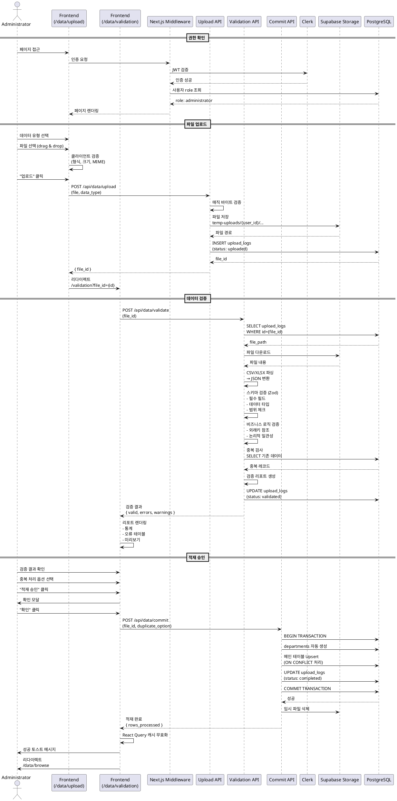

# 유스케이스: 데이터 파일 업로드 및 검증

## UC-003: 데이터 파일 업로드 및 검증

### 제목
관리자가 CSV/XLSX 파일을 업로드하고 데이터 무결성을 검증한 후 데이터베이스에 적재

---

## 1. 개요

### 1.1 목적
Ecount에서 추출한 대학교 성과 데이터(CSV/XLSX)를 시스템에 안전하게 업로드하고, 데이터 무결성을 검증한 후 데이터베이스에 적재하여 대시보드에서 활용할 수 있도록 한다.

### 1.2 범위
- CSV/XLSX 파일 업로드 인터페이스 제공
- 파일 형식 및 크기 검증
- 데이터 스키마 검증 (필수 필드, 데이터 타입)
- 비즈니스 로직 검증 (범위, 외래키 참조 무결성)
- 중복 데이터 검사 및 처리 옵션 제공
- 검증 리포트 생성
- 데이터베이스 트랜잭션 적재

**제외 사항**:
- 데이터 자동 변환 또는 정제 기능
- 실시간 데이터 동기화
- 파일 형식 자동 인식 (명시적 선택 필요)

### 1.3 액터
- **주요 액터**: 관리자 (Administrator)
- **부 액터**:
  - Clerk (인증/권한 확인)
  - Supabase Storage (파일 저장)
  - PostgreSQL Database (데이터 적재)

---

## 2. 선행 조건

- 관리자 계정으로 Google 로그인 완료
- 사용자 역할(role)이 'administrator'로 설정
- 업로드할 CSV/XLSX 파일 준비 완료
- 파일은 정해진 데이터 유형 중 하나에 해당 (학과KPI, 논문, 연구과제, 학생명단)
- Supabase Storage 용량 충분
- 네트워크 연결 정상

---

## 3. 참여 컴포넌트

### Frontend (Next.js)
- **File Upload UI** (`/data/upload`): 드래그앤드롭 및 파일 선택 인터페이스
- **Validation UI** (`/data/validation`): 검증 결과 리포트 및 데이터 미리보기

### Backend (Next.js API Routes)
- **Upload API** (`POST /api/data/upload`): 파일 수신 및 Storage 저장
- **Validation API** (`POST /api/data/validate`): 데이터 검증 로직 실행
- **Commit API** (`POST /api/data/commit`): DB 적재 트랜잭션

### External Services
- **Clerk**: 사용자 인증 및 권한 확인
- **Supabase Storage**: 임시 파일 저장 (버킷: temp-uploads)
- **PostgreSQL**: 데이터 적재 (departments, kpi_metrics, publications, research_projects, budget_executions, students, upload_logs)

### Libraries
- **Papa Parse**: CSV 파싱
- **XLSX.js**: XLSX 파싱
- **Zod**: 스키마 검증

---

## 4. 기본 플로우

### 4.1 단계별 흐름

#### Step 1: 파일 업로드 페이지 접근
1. **관리자**: `/data/upload` 페이지 접근
2. **Next.js Middleware**: Clerk 인증 확인
   - 입력: Request Header (JWT Token)
   - 처리: `clerkMiddleware()` 실행, 사용자 인증 상태 확인
   - 출력: 인증 성공 시 페이지 렌더링, 실패 시 로그인 페이지 리다이렉트
3. **Backend API**: 사용자 권한 확인
   - 입력: Clerk User ID
   - 처리: Supabase users 테이블에서 role 조회
   - 출력: role이 'administrator'인 경우 계속 진행, 아닐 경우 403 에러

#### Step 2: 데이터 유형 선택 및 파일 선택
4. **관리자**: 데이터 유형 선택 (드롭다운)
   - 옵션: 학과KPI, 논문 게재 목록, 연구과제 데이터, 학생 명부
5. **관리자**: CSV/XLSX 파일 선택 (드래그앤드롭 또는 파일 선택 버튼)
   - 입력: File 객체
   - 처리: 클라이언트 사이드 검증
     - 파일 확장자: .csv, .xlsx만 허용
     - 파일 크기: 최대 10MB
     - MIME 타입 검증
   - 출력: 검증 성공 시 파일 정보 미리보기 표시 (파일명, 크기, 예상 행 수)

#### Step 3: 파일 업로드
6. **관리자**: "업로드" 버튼 클릭
7. **Frontend**: POST /api/data/upload 요청
   - 입력: FormData (file, data_type)
   - 처리:
     - multipart/form-data로 파일 전송
     - 업로드 진행률 표시 (XHR progress event)
8. **Backend API**: 파일 수신 및 검증
   - 입력: File, data_type
   - 처리:
     - 파일 매직 바이트 검증 (보안)
     - Supabase Storage에 임시 저장
     - 경로: `temp-uploads/{user_id}/{timestamp}_{filename}`
     - upload_logs 테이블에 기록 (status: 'uploaded')
   - 출력: file_id (UUID)

#### Step 4: 데이터 검증
9. **Frontend**: 자동으로 `/data/validation?file_id={file_id}` 페이지로 리다이렉트
10. **Backend API**: POST /api/data/validate 요청
    - 입력: file_id
    - 처리:
      - Supabase Storage에서 파일 다운로드
      - CSV/XLSX 파싱 (Papa Parse / XLSX.js)
      - JSON 배열로 변환

11. **Backend**: 스키마 검증 (Zod)
    - 입력: JSON 배열, data_type
    - 처리:
      - data_type에 따른 Zod 스키마 선택
      - 각 행에 대해 검증 실행
        - 필수 필드 존재 확인
        - 데이터 타입 검증 (Number, String, Date, Boolean)
        - 날짜 형식 검증 (YYYY-MM-DD)
        - 숫자 범위 검증
    - 출력:
      - valid_rows: 유효한 행 배열
      - error_rows: 오류 행 배열 (행 번호, 필드명, 오류 메시지)
      - warning_rows: 경고 행 배열

12. **Backend**: 비즈니스 로직 검증
    - 처리:
      - 취업률: 0-100 범위 확인
      - 교원 수: 음수 불가
      - 날짜: 미래 날짜 경고
      - Impact Factor: 음수 불가
      - 외래키 참조 무결성 (단과대학명, 학과명 존재 여부)

13. **Backend**: 중복 검사
    - 입력: valid_rows, data_type
    - 처리:
      - 고유 식별자 기준 중복 검사
        - 학과KPI: (평가년도, 단과대학, 학과)
        - 논문: 논문ID
        - 연구과제: (과제번호, 집행ID)
        - 학생: 학번
      - 기존 DB 데이터와 비교 (SELECT 쿼리)
    - 출력: duplicate_rows (중복 레코드 목록)

14. **Backend**: 검증 리포트 생성
    - 출력:
      - 총 레코드 수
      - 유효 레코드 수
      - 오류 레코드 수 및 상세 내역
      - 경고 레코드 수 (중복)
      - upload_logs.status 업데이트 ('validated')

15. **Frontend**: 검증 결과 렌더링
    - 출력:
      - 검증 통계 (총 N건, 유효 M건, 오류 X건, 경고 Y건)
      - 오류 상세 테이블 (행 번호, 필드, 오류 내용, 값)
      - 데이터 미리보기 테이블 (최대 100행, 오류/경고 하이라이트)
      - 중복 처리 옵션 (라디오 버튼)
        - [ ] 중복 데이터 제외하고 적재
        - [ ] 중복 데이터로 기존 데이터 덮어쓰기
      - "적재 승인" 버튼 (오류 없을 때만 활성화)
      - "수정 후 재업로드" 버튼
      - "취소" 버튼

#### Step 5: DB 적재 승인
16. **관리자**: 검증 결과 확인 및 중복 처리 옵션 선택
17. **관리자**: "적재 승인" 버튼 클릭
18. **Frontend**: 확인 모달 표시
    - 메시지: "N건의 데이터를 적재하시겠습니까?"
    - 버튼: "취소" / "확인"

19. **관리자**: "확인" 클릭
20. **Backend API**: POST /api/data/commit 요청
    - 입력: file_id, duplicate_option
    - 처리:
      - PostgreSQL 트랜잭션 시작
      - data_type별 적재 로직 실행

      **학과KPI 적재**:
      ```sql
      -- departments 자동 생성/업데이트
      INSERT INTO departments (college_name, department_name)
      VALUES ('공과대학', '컴퓨터공학과')
      ON CONFLICT (college_name, department_name) DO NOTHING;

      -- kpi_metrics Upsert
      INSERT INTO kpi_metrics (department_id, evaluation_year, ...)
      VALUES (...)
      ON CONFLICT (department_id, evaluation_year)
      DO UPDATE SET ...;
      ```

      **논문 적재**:
      ```sql
      -- duplicate_option에 따라
      -- 중복 제외: ON CONFLICT DO NOTHING
      -- 덮어쓰기: ON CONFLICT DO UPDATE
      ```

      **연구과제 적재**:
      ```sql
      -- research_projects → budget_executions 순서로 적재
      ```

      **학생 적재**:
      ```sql
      -- students 테이블 Upsert
      ```

      - upload_logs 업데이트
        - status: 'completed'
        - rows_processed: 실제 적재 행 수
        - completed_at: 현재 시각
      - 트랜잭션 커밋
      - Supabase Storage 임시 파일 삭제
    - 출력: 성공 메시지, 적재 통계

21. **Frontend**: 적재 완료 처리
    - 출력:
      - 성공 토스트 메시지: "데이터 적재 완료 (N건)"
      - 적재 결과 모달
      - React Query 캐시 무효화 (대시보드 데이터)
      - 자동 리다이렉트: `/data/browse?recent=true`

### 4.2 시퀀스 다이어그램



---

## 5. 대안 플로우

### 5.1 중복 데이터 발견 시 처리

**시작 조건**: Step 13 (중복 검사) 이후, duplicate_rows가 존재하는 경우

**단계**:
1. 검증 리포트에 경고 섹션 표시
   - "중복 데이터: N건 발견"
   - 중복 레코드 목록 테이블 (기존 데이터와 비교)
2. 관리자에게 처리 옵션 제공
   - 옵션 1: 중복 데이터 제외하고 적재 (ON CONFLICT DO NOTHING)
   - 옵션 2: 중복 데이터로 기존 데이터 덮어쓰기 (ON CONFLICT DO UPDATE)
   - 옵션 3: 업로드 취소
3. 관리자가 옵션 선택 후 "적재 승인"
4. 선택된 옵션에 따라 SQL 쿼리 실행

**결과**:
- 옵션 1/2: 선택한 방식으로 데이터 적재 완료
- 옵션 3: 업로드 취소, upload_logs.status = 'cancelled'

### 5.2 외래키 오류 발견 시 자동 생성

**시작 조건**: Step 12 (비즈니스 로직 검증) 이후, 존재하지 않는 단과대학/학과 발견

**단계**:
1. 경고 메시지 표시
   - "새로운 단과대학/학과 발견: N개"
   - 자동 생성될 departments 목록 표시
2. 관리자 확인
   - "자동으로 departments 테이블에 추가됩니다."
3. 적재 시 departments 테이블에 자동 INSERT

**결과**: departments 테이블에 신규 레코드 생성 후 정상 적재

---

## 6. 예외 플로우

### 6.1 파일 형식 불일치

**발생 조건**: Step 5 (파일 선택) 시, CSV/XLSX가 아닌 파일 선택

**처리 방법**:
1. 클라이언트에서 즉시 에러 표시
2. 업로드 버튼 비활성화
3. 에러 메시지: "CSV 또는 XLSX 파일만 업로드 가능합니다."

**에러 코드**: 400 Bad Request

### 6.2 파일 크기 초과

**발생 조건**: Step 5 (파일 선택) 시, 파일 크기 > 10MB

**처리 방법**:
1. 클라이언트에서 즉시 에러 표시
2. 에러 메시지: "파일 크기는 10MB 이하여야 합니다. (현재: X MB)"

**에러 코드**: 413 Payload Too Large

### 6.3 권한 없음

**발생 조건**: Step 3 (권한 확인) 시, role이 'viewer'

**처리 방법**:
1. 403 에러 페이지 렌더링
2. 메시지: "접근 권한이 없습니다. 관리자만 데이터 업로드가 가능합니다."
3. "대시보드로 돌아가기" 버튼 제공

**에러 코드**: 403 Forbidden

### 6.4 필수 필드 누락

**발생 조건**: Step 11 (스키마 검증) 시, 필수 필드 미존재

**처리 방법**:
1. error_rows에 추가
2. 오류 상세: "필수 필드 누락: {필드명}"
3. 적재 승인 버튼 비활성화
4. 관리자에게 데이터 수정 후 재업로드 안내

**에러 코드**: 422 Unprocessable Entity

**사용자 메시지**: "행 {N}: 필수 필드 '{필드명}'이(가) 누락되었습니다."

### 6.5 데이터 타입 오류

**발생 조건**: Step 11 (스키마 검증) 시, 데이터 타입 불일치

**처리 방법**:
1. error_rows에 추가
2. 오류 상세: "데이터 타입 오류: 기대={타입}, 실제={값}"
3. 적재 승인 버튼 비활성화

**에러 코드**: 422 Unprocessable Entity

**사용자 메시지**: "행 {N}: '{필드명}'은(는) {타입} 형식이어야 합니다. (입력값: {값})"

### 6.6 DB 트랜잭션 실패

**발생 조건**: Step 20 (DB 적재) 시, 트랜잭션 오류 발생

**처리 방법**:
1. 자동 ROLLBACK 실행
2. upload_logs.status = 'failed'
3. error_message에 오류 내용 저장
4. 에러 모달 표시
5. "재시도" 버튼 제공

**에러 코드**: 500 Internal Server Error

**사용자 메시지**: "데이터 적재 중 오류가 발생했습니다. 잠시 후 다시 시도해주세요."

### 6.7 Storage 용량 부족

**발생 조건**: Step 8 (파일 업로드) 시, Supabase Storage 용량 초과

**처리 방법**:
1. 업로드 중단
2. 에러 메시지: "저장 공간이 부족합니다. 시스템 관리자에게 문의하세요."

**에러 코드**: 507 Insufficient Storage

---

## 7. 후행 조건

### 7.1 성공 시

**데이터베이스 변경**:
- `departments`: 신규 단과대학/학과 자동 생성 (있는 경우)
- 메인 테이블 (data_type에 따라):
  - `kpi_metrics`: Upsert (department_id, evaluation_year 기준)
  - `publications`: Upsert (publication_id 기준)
  - `research_projects`, `budget_executions`: Upsert (project_number, execution_id 기준)
  - `students`: Upsert (student_number 기준)
- `upload_logs`:
  - status = 'completed'
  - rows_processed = 실제 적재 행 수
  - completed_at = 현재 시각

**시스템 상태**:
- React Query 캐시 무효화 (대시보드 데이터)
- Supabase Storage 임시 파일 삭제

**외부 시스템**:
- 없음 (이메일 알림은 Optional)

### 7.2 실패 시

**데이터 롤백**:
- PostgreSQL 트랜잭션 ROLLBACK
- 데이터베이스 변경 사항 없음

**시스템 상태**:
- `upload_logs`:
  - status = 'failed'
  - error_message = 에러 내용
- Supabase Storage 임시 파일 유지 (디버깅용)

---

## 8. 비기능 요구사항

### 8.1 성능
- 파일 업로드: 10MB 파일 기준 5초 이내
- 데이터 검증: 1,000행 기준 2초 이내
- DB 적재: 1,000행 기준 5초 이내 (배치 단위: 1,000행)

### 8.2 보안
- 파일 매직 바이트 검증 (악성 파일 차단)
- Clerk JWT 토큰 기반 인증
- Supabase Service Role Key 사용 (서버 사이드)
- 파일 업로드 경로에 user_id 포함 (격리)
- 업로드 로그 기록 (audit trail)

### 8.3 가용성
- 업로드 실패 시 재시도 가능
- 임시 파일 7일 보관 후 자동 삭제
- 트랜잭션 실패 시 자동 롤백

---

## 9. UI/UX 요구사항

### 9.1 파일 업로드 페이지 (/data/upload)

**화면 구성**:
- 헤더: "데이터 파일 업로드"
- 데이터 유형 선택 (드롭다운)
  - 학과KPI
  - 논문 게재 목록
  - 연구과제 데이터
  - 학생 명부
- 파일 업로드 영역 (드래그앤드롭 지원)
  - 점선 테두리 박스
  - 아이콘: 업로드 아이콘
  - 텍스트: "CSV 또는 XLSX 파일을 드래그하거나 클릭하여 선택하세요"
  - 제한: "최대 10MB"
- 선택된 파일 정보
  - 파일명
  - 파일 크기
  - 예상 행 수
- 업로드 버튼 (Primary)
- 취소 버튼 (Secondary)

**사용자 경험**:
- 드래그앤드롭 시 테두리 하이라이트
- 업로드 중 진행률 표시 (0-100%)
- 업로드 성공 시 자동으로 검증 페이지 이동

### 9.2 데이터 검증 페이지 (/data/validation)

**화면 구성**:
- 헤더: "데이터 검증 결과"
- 검증 통계 섹션 (KPI 카드)
  - 총 레코드 수
  - 유효 레코드 수 (녹색)
  - 오류 레코드 수 (빨간색)
  - 경고 레코드 수 (노란색)
- 오류 상세 테이블 (오류가 있는 경우만 표시)
  - 컬럼: 행 번호, 필드, 오류 내용, 현재 값
  - 정렬 가능
  - "오류 데이터 다운로드 (CSV)" 버튼
- 중복 데이터 섹션 (중복이 있는 경우만 표시)
  - 중복 레코드 목록
  - 처리 옵션 (라디오 버튼)
- 데이터 미리보기 테이블
  - 최대 100행 표시
  - 페이지네이션 (50행/페이지)
  - 오류 행 빨간색 하이라이트
  - 경고 행 노란색 하이라이트
- 액션 버튼
  - "적재 승인" (Primary, 오류 없을 때만 활성화)
  - "수정 후 재업로드" (Secondary)
  - "취소" (Tertiary)

**사용자 경험**:
- 오류/경고 행에 마우스 오버 시 툴팁으로 상세 메시지 표시
- "적재 승인" 클릭 시 확인 모달
- 적재 중 로딩 인디케이터 표시
- 적재 완료 시 성공 토스트 메시지

---

## 10. 비즈니스 규칙

### BR-001: 파일 형식 제한
- CSV, XLSX 파일만 업로드 가능
- 최대 파일 크기: 10MB

### BR-002: 데이터 유형 매핑
| 데이터 유형 | CSV 파일 | DB 테이블 | 고유 식별자 |
|-----------|---------|---------|-----------|
| 학과KPI | department_kpi.csv | kpi_metrics | (department_id, evaluation_year) |
| 논문 게재 목록 | publication_list.csv | publications | publication_id |
| 연구과제 데이터 | research_project_data.csv | research_projects, budget_executions | (project_number, execution_id) |
| 학생 명부 | student_roster.csv | students | student_number |

### BR-003: 필수 필드 검증
각 데이터 유형별 필수 필드:
- **학과KPI**: 평가년도, 단과대학, 학과, 졸업생취업률, 전임교원수, 초빙교원수
- **논문**: 논문ID, 게재일, 단과대학, 학과, 논문제목, 주저자, 학술지명, 저널등급
- **연구과제**: 집행ID, 과제번호, 과제명, 연구책임자, 소속학과, 지원기관, 총연구비, 집행일자, 집행항목, 집행금액, 상태
- **학생**: 학번, 이름, 단과대학, 학과, 과정구분, 학적상태, 성별, 입학년도, 이메일

### BR-004: 데이터 범위 검증
- 취업률: 0 ≤ 취업률 ≤ 100
- 교원 수: ≥ 0
- 기술이전 수입: ≥ 0
- Impact Factor: ≥ 0 또는 NULL
- 날짜: ≤ 현재 날짜
- 평가년도: 2000 ≤ 평가년도 ≤ 2100

### BR-005: 중복 처리 정책
- 중복 발견 시 관리자가 선택
  - 옵션 1: 중복 제외 (기존 데이터 유지)
  - 옵션 2: 덮어쓰기 (신규 데이터로 업데이트)
- 기본값: 옵션 1 (안전한 선택)

### BR-006: departments 자동 생성
- CSV에 존재하지 않는 단과대학/학과가 있을 경우 자동으로 departments 테이블에 생성
- 중복 방지: ON CONFLICT (college_name, department_name) DO NOTHING

### BR-007: 배치 적재
- 1,000행 단위로 배치 INSERT
- 대용량 데이터 처리 시 성능 최적화

### BR-008: 업로드 이력 관리
- 모든 업로드는 upload_logs 테이블에 기록
- 상태: uploaded → validated → completed/failed
- 실패 시 error_message 저장

### BR-009: 임시 파일 보관 정책
- Supabase Storage에 7일간 보관
- 적재 완료 후 자동 삭제
- 실패 시 디버깅을 위해 유지

### BR-010: 트랜잭션 보장
- 모든 DB 적재는 단일 트랜잭션
- 실패 시 자동 ROLLBACK
- 부분 적재 불가

---

## 11. 테스트 시나리오

### 11.1 성공 케이스

| 테스트 케이스 ID | 입력값 | 기대 결과 |
|----------------|--------|----------|
| TC-003-01 | 유효한 department_kpi.csv (100행) | 검증 성공, 100건 적재 완료 |
| TC-003-02 | 유효한 publication_list.xlsx (50행) | 검증 성공, 50건 적재 완료 |
| TC-003-03 | 중복 데이터 포함 (옵션 1: 제외) | 중복 제외하고 적재 |
| TC-003-04 | 중복 데이터 포함 (옵션 2: 덮어쓰기) | 기존 데이터 업데이트 |
| TC-003-05 | 새로운 단과대학/학과 포함 | departments 자동 생성 후 적재 |

### 11.2 실패 케이스

| 테스트 케이스 ID | 입력값 | 기대 결과 |
|----------------|--------|----------|
| TC-003-06 | PDF 파일 업로드 | 에러: "CSV 또는 XLSX 파일만 가능" |
| TC-003-07 | 15MB CSV 파일 | 에러: "파일 크기 초과" |
| TC-003-08 | 필수 필드 누락 (취업률) | 검증 실패, 오류 상세 표시 |
| TC-003-09 | 취업률 105% | 검증 실패, 범위 오류 표시 |
| TC-003-10 | 잘못된 날짜 형식 (2023/13/01) | 검증 실패, 형식 오류 표시 |
| TC-003-11 | 일반 사용자 (viewer) 접근 | 403 Forbidden |
| TC-003-12 | DB 연결 실패 | 에러: "데이터베이스 연결 실패", 재시도 버튼 |

---

## 12. 관련 유스케이스

### 선행 유스케이스
- **UC-001: Google 로그인** - 관리자 인증 필요
- **UC-002: 사용자 역할 관리** - 관리자 권한 확인

### 후행 유스케이스
- **UC-004: 데이터 조회 및 관리** - 적재된 데이터 확인
- **UC-005: 대시보드 조회** - 업데이트된 데이터로 대시보드 갱신

### 연관 유스케이스
- **UC-006: 업로드 이력 조회** - upload_logs 테이블 조회

---

## 13. 변경 이력

| 버전 | 날짜 | 작성자 | 변경 내용 |
|------|------|--------|-----------|
| 1.0  | 2025-11-02 | AI Assistant | 초기 작성 |

---

## 부록

### A. 용어 정의

- **CSV (Comma-Separated Values)**: 콤마로 구분된 텍스트 파일 형식
- **XLSX**: Microsoft Excel 파일 형식
- **Upsert**: INSERT + UPDATE, 존재하면 업데이트, 없으면 삽입
- **ON CONFLICT**: PostgreSQL의 중복 처리 구문
- **Magic Byte**: 파일의 실제 타입을 식별하는 헤더 바이트
- **Zod**: TypeScript 스키마 검증 라이브러리
- **Service Role Key**: Supabase의 관리자 권한 API 키

### B. 참고 자료

- [PRD v1.0](/docs/prd.md) - 섹션 6.3 (데이터 관리 기능)
- [Userflow v1.0](/docs/userflow.md) - 섹션 4.1, 4.2 (데이터 관리 플로우)
- [Database Design v2.0](/docs/database.md) - 섹션 3.2 (테이블 상세 정의)
- [Clerk Integration](/docs/external/clerk.md) - 인증 및 권한 확인
- [Papa Parse Documentation](https://www.papaparse.com/) - CSV 파싱
- [XLSX.js Documentation](https://github.com/SheetJS/sheetjs) - XLSX 파싱
- [Zod Documentation](https://zod.dev/) - 스키마 검증
- [Supabase Storage](https://supabase.com/docs/guides/storage) - 파일 저장
