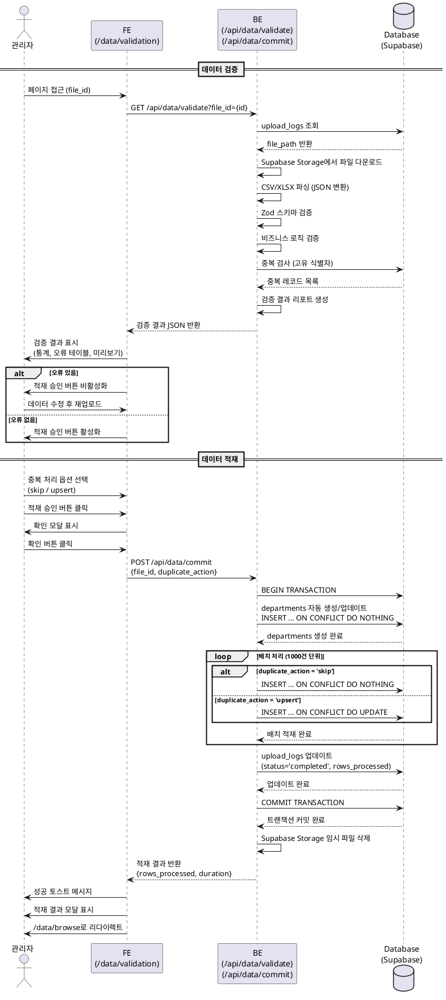
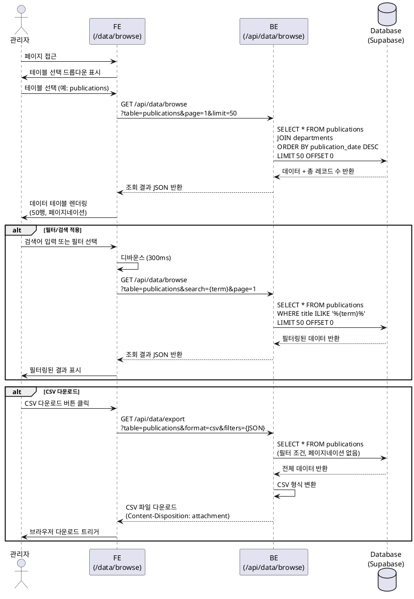
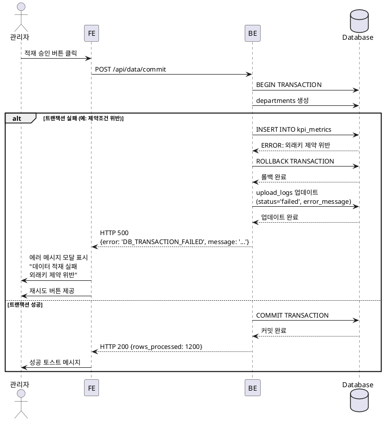

# 유스케이스 명세: 데이터 DB 적재 및 관리

## UC-004: 데이터 DB 적재 및 관리

**버전**: 1.0
**작성일**: 2025-11-02
**작성자**: AI Assistant
**관련 문서**: PRD v1.0, Userflow v1.0, Database v2.0

---

## 1. 개요

### 1.1 목적

CSV 파일로 업로드된 대학교 데이터를 검증하고 데이터베이스에 안전하게 적재하며, 적재된 데이터를 조회 및 관리할 수 있는 기능을 제공합니다.

### 1.2 범위

**포함 범위:**
- CSV 파일 데이터 파싱 및 스키마 검증
- 데이터 무결성 검사 (필수 필드, 데이터 타입, 논리적 일관성)
- 중복 데이터 감지 및 처리 옵션 제공
- 트랜잭션 기반 데이터베이스 적재 (Upsert 로직)
- 적재 이력 기록 및 결과 통지
- 적재된 데이터 조회, 필터링, 다운로드

**제외 범위:**
- CSV 파일 업로드 프로세스 (UC-003에서 처리)
- 실시간 데이터 동기화
- 데이터 수정/삭제 기능 (v2.0에서 추가 예정)

### 1.3 액터

**주요 액터:**
- 관리자 (Administrator): 데이터 검증, 적재 승인, 데이터 조회 권한 보유

**부 액터:**
- Supabase PostgreSQL: 데이터 저장소
- Supabase Storage: 원본 파일 임시 저장소
- React Query: 캐시 관리

---

## 2. 선행 조건

- 관리자 권한으로 로그인되어 있어야 함
- UC-003을 통해 CSV 파일이 Supabase Storage에 업로드되어 있어야 함
- upload_logs 테이블에 file_id와 file_path가 기록되어 있어야 함
- 데이터 유형(data_type)이 선택되어 있어야 함

---

## 3. 참여 컴포넌트

**프론트엔드:**
- `/data/validation` 페이지: 데이터 검증 결과 표시
- `/data/browse` 페이지: 적재된 데이터 조회

**백엔드:**
- `POST /api/data/validate`: 데이터 검증 API
- `POST /api/data/commit`: 데이터 적재 API
- `GET /api/data/browse`: 데이터 조회 API

**데이터베이스:**
- departments 테이블: 단과대학/학과 정보 (자동 생성)
- kpi_metrics, publications, research_projects, budget_executions, students 테이블: 데이터 적재
- upload_logs 테이블: 적재 이력 기록

**외부 서비스:**
- Supabase Storage: 원본 파일 저장
- Clerk: 사용자 인증 및 권한 확인

---

## 4. 기본 플로우: 데이터 검증 및 적재

### Trigger
관리자가 파일 업로드 완료 후 자동으로 데이터 검증 페이지(`/data/validation?file_id={id}`)로 리다이렉트됨

### Main Scenario

#### 4.1 데이터 검증 단계

1. **관리자**: `/data/validation?file_id={file_id}` 페이지 접근
   - 입력: URL 파라미터 file_id

2. **FE**: 검증 API 호출
   - GET `/api/data/validate?file_id={file_id}`

3. **BE**: 파일 로드 및 파싱
   - upload_logs에서 file_path 조회
   - Supabase Storage에서 파일 다운로드
   - CSV/XLSX 파일을 JSON 배열로 변환
   - 첫 100행 미리보기 데이터 추출

4. **BE**: 스키마 검증 (Zod)
   - data_type에 따른 스키마 선택
   - 필수 필드 존재 확인
   - 데이터 타입 검증 (Number, String, Date, Boolean)
   - 날짜 형식 검증 (YYYY-MM-DD)
   - 숫자 범위 검증 (취업률 0-100%, 음수 체크 등)

5. **BE**: 비즈니스 로직 검증
   - 논리적 일관성 체크 (취업률 범위, 교원 수 음수 불가 등)
   - 외래키 참조 무결성 (단과대학명, 학과명 departments 테이블 확인)

6. **BE**: 중복 검사
   - 고유 식별자 기준 중복 검사 (학과KPI: 평가년도+학과, 논문: 논문ID 등)
   - 기존 DB 데이터와 비교
   - 중복 레코드 목록 생성

7. **BE**: 검증 결과 리포트 생성
   - 총 레코드 수, 유효 레코드 수, 오류 레코드 수, 경고 레코드 수
   - 오류 상세 내역 (행 번호, 필드명, 오류 메시지)
   - 검증 결과 JSON 반환

8. **FE**: 검증 결과 표시
   - 검증 통계 카드 표시
   - 오류 상세 테이블 렌더링 (행, 필드, 오류 내용, 값)
   - 데이터 미리보기 테이블 렌더링 (오류/경고 행 하이라이트)
   - 중복 데이터 발견 시 처리 옵션 표시:
     * [ ] 중복 데이터 제외하고 적재
     * [ ] 중복 데이터로 기존 데이터 덮어쓰기 (Upsert)
   - 오류 없을 시 "적재 승인" 버튼 활성화

#### 4.2 데이터 적재 단계

9. **관리자**: 검증 결과 확인 및 "적재 승인" 버튼 클릭
   - 입력: file_id, 중복 처리 옵션 (duplicate_action: 'skip' | 'upsert')

10. **FE**: 확인 모달 표시
    - "1,200건의 데이터를 적재하시겠습니까?"
    - 취소 / 확인 버튼

11. **관리자**: 확인 버튼 클릭

12. **FE**: 적재 API 호출
    - POST `/api/data/commit`
    - Body: { file_id, duplicate_action }

13. **BE**: 적재 전 최종 확인
    - upload_logs.status === 'validated' 확인
    - 사용자 권한 재확인

14. **Database**: 트랜잭션 시작
    - BEGIN TRANSACTION

15. **BE**: departments 자동 생성/업데이트
    - CSV 데이터에서 고유한 (college_name, department_name) 추출
    - INSERT ... ON CONFLICT (college_name, department_name) DO NOTHING

16. **BE**: 메인 테이블 Upsert (데이터 유형별)

    **학과KPI (department_kpi → kpi_metrics):**
    ```sql
    INSERT INTO kpi_metrics (
      department_id, evaluation_year, employment_rate,
      full_time_faculty, visiting_faculty,
      tech_transfer_income, intl_conference_count
    )
    VALUES (...)
    ON CONFLICT (department_id, evaluation_year)
    DO UPDATE SET
      employment_rate = EXCLUDED.employment_rate,
      full_time_faculty = EXCLUDED.full_time_faculty,
      -- ... 기타 필드
      updated_at = NOW();
    ```

    **논문 (publication_list → publications):**
    ```sql
    -- duplicate_action = 'skip'
    INSERT INTO publications (...)
    VALUES (...)
    ON CONFLICT (publication_id) DO NOTHING;

    -- duplicate_action = 'upsert'
    INSERT INTO publications (...)
    VALUES (...)
    ON CONFLICT (publication_id) DO UPDATE SET
      title = EXCLUDED.title,
      -- ... 기타 필드
      created_at = COALESCE(publications.created_at, NOW());
    ```

    **연구과제 (research_project_data → research_projects, budget_executions):**
    ```sql
    -- research_projects 먼저 적재
    INSERT INTO research_projects (...)
    VALUES (...)
    ON CONFLICT (project_number) DO UPDATE SET ...;

    -- budget_executions 적재 (FK 참조)
    INSERT INTO budget_executions (...)
    VALUES (...)
    ON CONFLICT (execution_id) DO UPDATE SET ...;
    ```

    **학생 (student_roster → students):**
    ```sql
    INSERT INTO students (...)
    VALUES (...)
    ON CONFLICT (student_number) DO UPDATE SET ...;
    ```

17. **BE**: 배치 처리 (1000건 단위)
    - 대용량 데이터의 경우 배치로 분할하여 적재
    - 진행률 계산 및 업데이트

18. **BE**: upload_logs 업데이트
    ```sql
    UPDATE upload_logs SET
      status = 'completed',
      rows_processed = {actual_count},
      completed_at = NOW()
    WHERE id = {file_id};
    ```

19. **Database**: 트랜잭션 커밋
    - COMMIT

20. **BE**: 임시 파일 정리
    - Supabase Storage에서 임시 파일 삭제

21. **BE**: 캐시 무효화
    - React Query 관련 쿼리 키 무효화 태그 전송

22. **FE**: 적재 완료 처리
    - 성공 토스트 메시지 표시
    - 적재 결과 모달 표시:
      * 적재 완료: 1,200건
      * 소요 시간: 3.2초
      * "데이터 조회" 버튼
      * "대시보드 확인" 버튼
    - 자동 리다이렉트: `/data/browse?recent=true`

---

## 5. 기본 플로우: 데이터 조회

### Trigger
관리자가 데이터 조회 페이지(`/data/browse`)에 접근

### Main Scenario

1. **관리자**: `/data/browse` 페이지 접근

2. **FE**: 테이블 선택 드롭다운 표시
   - KPI 메트릭
   - 논문 게재
   - 연구과제
   - 예산 집행
   - 학생 정보

3. **관리자**: 테이블 선택 (예: 논문 게재)

4. **FE**: 조회 API 호출
   - GET `/api/data/browse?table=publications&page=1&limit=50`

5. **BE**: 데이터 쿼리
   ```typescript
   const { data, count } = await supabase
     .from('publications')
     .select('*, departments(college_name, department_name)', { count: 'exact' })
     .order('publication_date', { ascending: false })
     .range(0, 49);
   ```

6. **FE**: 데이터 테이블 렌더링
   - 컬럼 헤더 (정렬 아이콘 포함)
   - 데이터 행 (50행/페이지)
   - 페이지네이션 컨트롤
   - 총 레코드 수 표시: "1,234건 중 1-50"

7. **관리자**: 필터 적용 또는 검색
   - 입력: 검색어, 날짜 범위, 필터 조건

8. **FE**: 디바운스 후 필터링된 API 호출
   ```
   GET /api/data/browse?table=publications&search={term}&startDate={date}&page=1
   ```

9. **BE**: 필터링 쿼리 실행
   ```typescript
   .ilike('title', `%${searchTerm}%`)
   .gte('publication_date', startDate)
   .lte('publication_date', endDate)
   ```

10. **FE**: 필터링된 결과 표시

11. **관리자**: "CSV 다운로드" 버튼 클릭

12. **FE**: 다운로드 API 호출
    - GET `/api/data/export?table=publications&format=csv&filters={JSON}`

13. **BE**: 현재 필터 조건으로 전체 데이터 조회
    - 페이지네이션 없이 전체 데이터
    - CSV 형식으로 변환

14. **BE**: CSV 파일 생성 및 응답
    - Content-Disposition: attachment; filename="publications_20251102_143522.csv"
    - Content-Type: text/csv

15. **FE**: 브라우저 다운로드 트리거

---

## 6. 대안 플로우

### 6.1 중복 데이터 제외 적재

**시작 조건**: 검증 단계에서 중복 데이터 발견 시

**단계:**
1. 관리자가 "중복 데이터 제외하고 적재" 옵션 선택
2. duplicate_action = 'skip'으로 API 호출
3. Upsert 쿼리에서 `ON CONFLICT ... DO NOTHING` 사용
4. 중복 제외된 레코드 수 결과에 포함

**결과**: 중복 데이터는 무시되고 신규 데이터만 적재됨

### 6.2 중복 데이터 덮어쓰기 (Upsert)

**시작 조건**: 검증 단계에서 중복 데이터 발견 시

**단계:**
1. 관리자가 "중복 데이터로 기존 데이터 덮어쓰기" 옵션 선택
2. duplicate_action = 'upsert'으로 API 호출
3. Upsert 쿼리에서 `ON CONFLICT ... DO UPDATE SET ...` 사용
4. 기존 데이터가 새로운 데이터로 업데이트됨
5. 업데이트된 레코드 수 결과에 포함

**결과**: 중복 데이터가 새로운 값으로 갱신됨

### 6.3 외래키 자동 생성

**시작 조건**: 검증 단계에서 존재하지 않는 학과명 발견

**단계:**
1. BE에서 departments 테이블에 없는 (college_name, department_name) 감지
2. 경고 메시지 표시: "새로운 학과가 자동 생성됩니다: [목록]"
3. 관리자가 적재 승인 시 자동으로 departments에 INSERT
4. 메인 테이블 적재 시 생성된 department_id 참조

**결과**: departments 테이블이 자동으로 업데이트됨

---

## 7. 예외 플로우

### 7.1 필수 필드 누락

**발생 조건**: CSV 데이터에 필수 컬럼이 없거나 NULL 값인 경우

**처리 방법:**
1. 검증 단계에서 오류로 분류
2. 오류 상세 테이블에 표시:
   - 행 번호: 5
   - 필드: 취업률
   - 오류 내용: 필수 필드 누락
   - 값: NULL
3. "적재 승인" 버튼 비활성화
4. 사용자 메시지: "오류를 수정한 후 다시 업로드해주세요"

**에러 코드**: `VALIDATION_ERROR_MISSING_FIELD` (HTTP 400)

### 7.2 데이터 타입 불일치

**발생 조건**: 숫자 필드에 문자열 입력 등

**처리 방법:**
1. Zod 스키마 검증 실패
2. 오류 상세 표시:
   - 행 번호: 12
   - 필드: 전임교원수
   - 오류 내용: 숫자 형식이 아님
   - 값: "abc"
3. 적재 차단

**에러 코드**: `VALIDATION_ERROR_TYPE_MISMATCH` (HTTP 400)

### 7.3 범위 초과 값

**발생 조건**: 취업률이 100을 초과하거나 음수인 경우

**처리 방법:**
1. CHECK 제약조건 검증 실패
2. 오류 상세 표시:
   - 행 번호: 5
   - 필드: 취업률
   - 오류 내용: 범위 초과 (0-100)
   - 값: 105
3. 적재 차단

**에러 코드**: `VALIDATION_ERROR_OUT_OF_RANGE` (HTTP 400)

### 7.4 외래키 참조 무결성 오류

**발생 조건**: 존재하지 않는 학과명 참조 (자동 생성 옵션 선택 안 함)

**처리 방법:**
1. 검증 단계에서 경고로 분류
2. 경고 메시지: "존재하지 않는 학과명: [목록]"
3. 관리자 선택:
   - 자동 생성 허용
   - 데이터 수정 후 재업로드

**에러 코드**: `VALIDATION_WARNING_FOREIGN_KEY` (HTTP 200, warning)

### 7.5 트랜잭션 실패

**발생 조건**: DB 연결 오류, 제약조건 위반, 타임아웃 등

**처리 방법:**
1. 트랜잭션 자동 롤백 (ROLLBACK)
2. upload_logs.status = 'failed'
3. error_message 기록
4. 사용자 에러 메시지 표시:
   - "데이터 적재 실패"
   - 원인: "데이터베이스 연결 오류"
   - "잠시 후 다시 시도해주세요"
5. "재시도" 버튼 표시

**에러 코드**: `DB_TRANSACTION_FAILED` (HTTP 500)

### 7.6 동시 적재 충돌

**발생 조건**: 여러 관리자가 동시에 같은 데이터 적재 시도

**처리 방법:**
1. 트랜잭션 락 감지
2. 대기 또는 에러 반환
3. 사용자 메시지: "다른 관리자가 데이터를 적재 중입니다. 잠시 후 다시 시도해주세요"

**에러 코드**: `DB_LOCK_CONFLICT` (HTTP 409)

### 7.7 대용량 데이터 타임아웃

**발생 조건**: 10,000행 이상 데이터 적재 시 타임아웃

**처리 방법:**
1. 배치 크기 자동 조정 (1000 → 500)
2. 진행률 표시 및 백그라운드 처리
3. 완료 시 이메일 알림 (선택 사항)

**에러 코드**: `DB_TIMEOUT` (HTTP 504)

---

## 8. 후행 조건

### 8.1 성공 시

**데이터베이스 변경:**
- departments 테이블: 신규 학과 자동 생성 (해당 시)
- 메인 테이블 (kpi_metrics, publications 등): 데이터 INSERT 또는 UPDATE
- upload_logs 테이블: status = 'completed', rows_processed 업데이트

**시스템 상태:**
- React Query 캐시 무효화 (관련 대시보드 데이터 재조회)
- 임시 파일 삭제 (Supabase Storage)
- 적재 이력 기록 (로그)

**외부 시스템:**
- 관리자 이메일 알림 (선택 사항): "데이터 적재 완료: 1,200건"

### 8.2 실패 시

**데이터 롤백:**
- 트랜잭션 ROLLBACK으로 모든 변경 사항 취소
- upload_logs.status = 'failed'
- error_message 기록

**시스템 상태:**
- 임시 파일 유지 (재시도 가능)
- 에러 로그 기록 (Sentry)
- 관리자 알림

---

## 9. 비기능 요구사항

### 9.1 성능

- **검증 속도**: 1,000행 데이터 < 2초
- **적재 속도**: 1,000행 데이터 < 5초
- **조회 응답 시간**: 50행 페이지 < 500ms
- **다운로드**: 10,000행 CSV < 10초
- **배치 크기**: 1,000행 단위 (조정 가능)

### 9.2 보안

- **인증**: Clerk 인증 필수 (middleware)
- **권한**: 관리자 역할만 접근 가능 (RBAC)
- **SQL Injection 방지**: Prepared Statements 사용 (Supabase 기본 제공)
- **데이터 암호화**: Supabase SSL/TLS 연결
- **감사 로그**: upload_logs에 모든 적재 이력 기록

### 9.3 가용성

- **트랜잭션**: ACID 보장
- **롤백**: 실패 시 자동 롤백
- **재시도**: 네트워크 오류 시 자동 재시도 (최대 3회)
- **백업**: 임시 파일 7일 보관 (복구 가능)

### 9.4 확장성

- **데이터 규모**: 최대 100,000행 처리 가능
- **동시 사용자**: 10명 동시 적재 가능
- **배치 처리**: 대용량 데이터 자동 분할

---

## 10. Business Rules

### BR-1: 중복 처리 정책
- 고유 식별자 기준 중복 판단:
  - 학과KPI: (department_id, evaluation_year)
  - 논문: (publication_id)
  - 연구과제: (project_number)
  - 예산 집행: (execution_id)
  - 학생: (student_number)
- 중복 발견 시 관리자가 처리 방법 선택 (skip / upsert)

### BR-2: 외래키 자동 생성 정책
- departments 테이블에 없는 (college_name, department_name) 발견 시 자동 생성
- 관리자에게 경고 메시지 표시
- 적재 승인 시 자동으로 INSERT

### BR-3: 데이터 검증 규칙
- 필수 필드 누락 시 적재 차단
- 데이터 타입 불일치 시 적재 차단
- 범위 초과 값 (취업률 0-100%, 음수 등) 적재 차단
- 미래 날짜 경고 (현재 날짜 초과 publication_date, execution_date)

### BR-4: 트랜잭션 정책
- 모든 적재 작업은 트랜잭션으로 처리
- 일부 실패 시 전체 롤백 (All or Nothing)
- 배치 단위로 커밋하지 않음 (단일 트랜잭션)

### BR-5: 데이터 보관 정책
- 임시 파일: 적재 완료 후 삭제 (실패 시 7일 보관)
- upload_logs: 1년 후 자동 삭제 (정책에 따라 조정 가능)
- 원본 데이터: Supabase Storage 백업 (7일 보관)

### BR-6: 권한 정책
- 데이터 적재: 관리자 전용
- 데이터 조회: 관리자 전용 (v1.0), 향후 일반 사용자도 제한적 조회 가능 (v2.0)
- 데이터 삭제: 관리자 전용 (v2.0에서 추가 예정)

---

## 11. 시퀀스 다이어그램

### 11.1 데이터 검증 및 적재 플로우



### 11.2 데이터 조회 플로우



### 11.3 예외 처리 플로우 (트랜잭션 실패)



---

## 12. 테스트 시나리오

### 12.1 성공 케이스

| 테스트 케이스 ID | 입력값 | 기대 결과 |
|----------------|--------|----------|
| TC-004-01 | 유효한 department_kpi.csv (1000행, 오류 없음) | 검증 성공, 1000건 적재 완료 |
| TC-004-02 | publication_list.csv (중복 10건, skip 옵션) | 검증 경고, 990건 적재 (중복 제외) |
| TC-004-03 | publication_list.csv (중복 10건, upsert 옵션) | 검증 경고, 1000건 적재 (중복 업데이트) |
| TC-004-04 | 새로운 학과명 포함, 자동 생성 허용 | departments 테이블에 신규 학과 생성, 적재 완료 |
| TC-004-05 | 데이터 조회 (publications, 검색: "AI") | 검색어 포함된 논문 목록 반환 |
| TC-004-06 | CSV 다운로드 (publications, 필터: SCIE) | SCIE 논문만 포함된 CSV 파일 다운로드 |

### 12.2 실패 케이스

| 테스트 케이스 ID | 입력값 | 기대 결과 |
|----------------|--------|----------|
| TC-004-E01 | 필수 필드 누락 (취업률 NULL) | 검증 실패, 오류 상세 표시, 적재 차단 |
| TC-004-E02 | 데이터 타입 불일치 (전임교원수: "abc") | 검증 실패, 타입 오류 표시, 적재 차단 |
| TC-004-E03 | 범위 초과 (취업률: 105) | 검증 실패, 범위 오류 표시, 적재 차단 |
| TC-004-E04 | 미래 날짜 (publication_date: 2026-01-01) | 검증 경고 표시, 적재는 허용 |
| TC-004-E05 | DB 연결 오류 (네트워크 끊김) | 트랜잭션 롤백, 에러 메시지, 재시도 버튼 |
| TC-004-E06 | 동시 적재 충돌 (2명 관리자 동시 적재) | 락 감지, "다른 관리자가 적재 중" 메시지 |
| TC-004-E07 | 권한 없음 (일반 사용자 접근) | HTTP 403, "접근 권한이 없습니다" 페이지 |

---

## 13. 관련 유스케이스

- **선행 유스케이스**:
  - UC-001: 사용자 인증 및 권한 관리
  - UC-003: CSV 파일 업로드

- **후행 유스케이스**:
  - UC-005: 대시보드 데이터 조회 및 시각화
  - UC-006: 데이터 내보내기 및 리포트 생성 (v2.0)

- **연관 유스케이스**:
  - UC-007: 데이터 수정/삭제 (v2.0)
  - UC-008: 감사 로그 조회 (v2.0)

---

## 14. 변경 이력

| 버전 | 날짜 | 작성자 | 변경 내용 |
|------|------|--------|-----------|
| 1.0 | 2025-11-02 | AI Assistant | 초기 작성: Userflow 4.3, 4.4 기반 |

---

## 부록

### A. 용어 정의

- **Upsert**: INSERT + UPDATE의 합성어. 데이터가 없으면 INSERT, 있으면 UPDATE 수행
- **ON CONFLICT**: PostgreSQL의 Upsert 구문. 중복 키 발견 시 동작 정의
- **Zod**: TypeScript 스키마 검증 라이브러리
- **트랜잭션**: 데이터베이스 작업의 원자성 보장. All or Nothing
- **배치 처리**: 대용량 데이터를 일정 단위로 나누어 처리

### B. 참고 자료

- PRD v1.0: FR-DATA-001, FR-DATA-002, FR-DATA-003
- Userflow v1.0: Section 4.2 (데이터 검증), 4.3 (DB 적재), 4.4 (데이터 조회)
- Database v2.0: Section 3 (스키마), Section 5 (제약조건), Section 8 (마이그레이션)
- Supabase Documentation: https://supabase.com/docs/guides/database/transactions
- PostgreSQL Upsert: https://www.postgresql.org/docs/current/sql-insert.html#SQL-ON-CONFLICT
