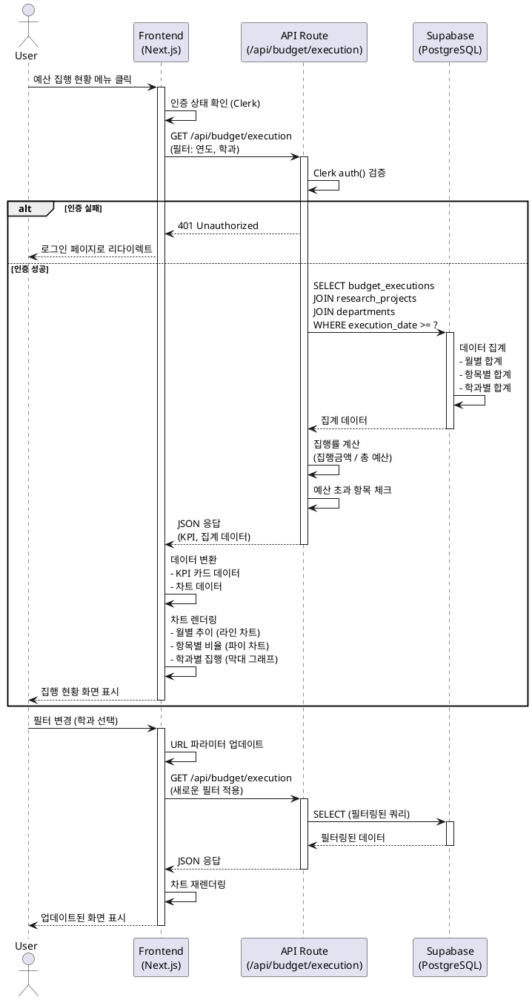

# 유스케이스: 예산 집행 현황 관리

## 유스케이스 ID: UC-005

### 제목
예산 집행 현황 조회 및 분석

---

## 1. 개요

### 1.1 목적
연구과제별 예산 집행 내역을 조회하고, 월별/항목별 집계를 통해 예산 집행률을 모니터링하며, 예산 초과 상황을 사전에 인지하여 효율적인 예산 관리를 지원합니다.

### 1.2 범위
- 예산 집행 현황 조회 (월별, 항목별, 학과별)
- 예산 집행률 계산 및 표시
- 예산 집행 추이 시각화
- 예산 초과 경고 표시
- 집행 항목별 비율 분석
- 집행 상태별 통계 제공

**제외 사항:**
- 예산 집행 데이터 직접 수정
- 예산 승인/결재 프로세스
- 실시간 집행 알림

### 1.3 액터
- **주요 액터**: 인증된 사용자 (대학 경영진, 연구지원 담당자, 학과장)
- **부 액터**: Supabase (데이터베이스), Clerk (인증)

---

## 2. 선행 조건

- 사용자가 Google 계정으로 로그인되어 있어야 함
- 사용자 세션이 유효해야 함 (Clerk JWT 토큰)
- budget_executions 테이블에 예산 집행 데이터가 존재해야 함
- research_projects 테이블에 연구과제 정보가 존재해야 함

---

## 3. 참여 컴포넌트

- **Frontend (Next.js)**: 사용자 인터페이스, 차트 렌더링, 필터 제어
- **API Routes**: 데이터 조회 및 집계 로직
- **Clerk**: 사용자 인증 및 세션 관리
- **Supabase**: 예산 집행 데이터 저장소
- **React Query**: 데이터 캐싱 및 상태 관리
- **Chart Library**: 차트 시각화 (Recharts/Chart.js)

---

## 4. 기본 플로우 (Basic Flow)

### 4.1 단계별 흐름

1. **사용자**: 사이드바 메뉴에서 "예산 관리 → 예산 집행 현황" 클릭
   - 입력: 메뉴 클릭 이벤트
   - 처리: Next.js 라우팅을 통해 `/dashboard/budget/execution` 페이지로 이동
   - 출력: 페이지 전환, 로딩 인디케이터 표시

2. **Frontend**: 인증 상태 확인 및 초기 데이터 요청
   - 입력: 페이지 마운트
   - 처리:
     - Clerk `useUser()` 훅으로 인증 확인
     - React Query를 통해 GET `/api/budget/execution` 요청
     - 필터 초기값 설정 (기본: 최근 1년, 전체 학과)
   - 출력: 로딩 스켈레톤 표시

3. **API Route**: 사용자 인증 검증
   - 입력: HTTP GET 요청
   - 처리:
     - Clerk `auth()` 함수로 userId 추출
     - userId가 없으면 401 Unauthorized 반환
   - 출력: 인증 상태 확인

4. **API Route**: 예산 집행 데이터 조회
   - 입력: 쿼리 파라미터 (연도, 학과, 집행항목, 상태)
   - 처리:
     - Supabase Service Role Client 생성
     - budget_executions 테이블과 research_projects 테이블 JOIN
     - WHERE 조건 적용 (필터)
     - 집계 쿼리 실행:
       - 월별 집행금액 합계
       - 집행항목별 금액 합계
       - 학과별 집행금액 합계
       - 상태별 집계 (집행완료, 처리중)
   - 출력: JSON 응답 (집계 데이터)

5. **Database**: 데이터 조회 및 집계
   - 입력: SQL 쿼리
   - 처리:
     ```sql
     SELECT
       DATE_TRUNC('month', be.execution_date) AS month,
       SUM(be.execution_amount) AS total_amount,
       be.execution_item,
       be.status,
       d.department_name,
       COUNT(*) AS execution_count
     FROM budget_executions be
     JOIN research_projects rp ON rp.id = be.project_id
     JOIN departments d ON d.id = rp.department_id
     WHERE be.execution_date >= '2024-01-01'
     GROUP BY month, be.execution_item, be.status, d.department_name
     ORDER BY month DESC
     ```
   - 출력: 집계된 데이터셋

6. **Frontend**: 데이터 변환 및 차트 렌더링
   - 입력: API 응답 데이터
   - 처리:
     - KPI 카드 데이터 계산:
       - 총 집행금액
       - 집행률 (집행금액 / 총 예산 × 100)
       - 처리중 금액
     - 차트 데이터 변환:
       - 월별 추이 데이터 (라인 차트용)
       - 집행항목별 비율 (파이 차트용)
       - 학과별 집행금액 (막대 그래프용)
     - 예산 초과 항목 체크
   - 출력: 렌더링된 대시보드

7. **사용자**: 집행 현황 확인
   - 입력: 화면에 표시된 데이터
   - 처리:
     - KPI 카드 확인
     - 차트 상호작용 (호버, 클릭)
     - 집행 내역 테이블 스크롤
   - 출력: 정보 인지

8. **사용자**: 필터 적용 (선택 사항)
   - 입력: 필터 변경 (연도, 학과, 집행항목, 상태)
   - 처리:
     - URL 쿼리 파라미터 업데이트
     - React Query 쿼리 키 변경으로 자동 재요청
   - 출력: 필터링된 데이터로 차트 재렌더링

### 4.2 시퀀스 다이어그램



---

## 5. 대안 플로우 (Alternative Flows)

### 5.1 대안 플로우 1: 과제별 상세 조회

**시작 조건**: 사용자가 집행 내역 테이블에서 특정 과제 클릭

**단계**:
1. 사용자가 집행 내역 테이블에서 과제번호 클릭
2. Frontend에서 `/dashboard/budget/projects?project_id={id}` 페이지로 이동
3. 해당 과제의 상세 집행 내역 표시

**결과**: 과제별 예산 상세 페이지로 전환

### 5.2 대안 플로우 2: CSV 다운로드

**시작 조건**: 사용자가 "CSV 다운로드" 버튼 클릭

**단계**:
1. 사용자가 다운로드 버튼 클릭
2. 현재 필터 조건으로 전체 데이터 조회 (페이지네이션 없이)
3. 데이터를 CSV 형식으로 변환
4. Blob 생성 및 다운로드 트리거
5. 파일명: `budget_execution_{timestamp}.csv`

**결과**: CSV 파일 다운로드 완료

---

## 6. 예외 플로우 (Exception Flows)

### 6.1 예외 상황 1: 인증 실패

**발생 조건**: JWT 토큰 만료 또는 유효하지 않은 세션

**처리 방법**:
1. API Route에서 401 Unauthorized 반환
2. Frontend에서 에러 감지
3. 현재 URL을 redirect_url 파라미터로 저장
4. 로그인 페이지로 리다이렉트
5. 토스트 메시지: "세션이 만료되었습니다. 다시 로그인해주세요."

**에러 코드**: `401` (HTTP 상태 코드)

**사용자 메시지**: "세션이 만료되었습니다. 다시 로그인해주세요."

### 6.2 예외 상황 2: 데이터 없음

**발생 조건**: 선택한 필터 조건에 해당하는 데이터가 없음

**처리 방법**:
1. API에서 빈 배열 반환
2. Frontend에서 빈 상태 UI 표시
3. 안내 메시지 및 필터 초기화 버튼 제공

**사용자 메시지**: "선택한 조건에 해당하는 집행 내역이 없습니다. 필터를 초기화해주세요."

### 6.3 예외 상황 3: 데이터베이스 연결 실패

**발생 조건**: Supabase 연결 오류 또는 타임아웃

**처리 방법**:
1. API Route에서 예외 catch
2. 에러 로그 기록 (Sentry, Vercel Logs)
3. 500 Internal Server Error 반환
4. Frontend에서 에러 상태 표시
5. 재시도 버튼 제공

**에러 코드**: `500` (HTTP 상태 코드)

**사용자 메시지**: "데이터를 불러오는 중 오류가 발생했습니다. 잠시 후 다시 시도해주세요."

### 6.4 예외 상황 4: 예산 초과 감지

**발생 조건**: 특정 과제의 집행금액이 총 예산을 초과

**처리 방법**:
1. API에서 집행률 계산 시 초과 여부 체크
2. 초과 항목을 별도 플래그로 표시
3. Frontend에서 경고 아이콘 및 빨간색 하이라이트 표시
4. 툴팁 메시지: "예산 초과: {초과금액}원"

**사용자 메시지**: "일부 과제에서 예산 초과가 발생했습니다. 상세 내역을 확인해주세요."

### 6.5 예외 상황 5: 필터 값 불일치

**발생 조건**: URL 파라미터에 잘못된 값이 포함됨

**처리 방법**:
1. API Route에서 쿼리 파라미터 검증 (Zod 스키마)
2. 유효하지 않은 값은 무시하고 기본값 사용
3. Frontend에서 올바른 필터 값으로 URL 업데이트

**에러 코드**: 없음 (Graceful degradation)

**사용자 메시지**: 없음 (자동 복구)

---

## 7. 후행 조건 (Post-conditions)

### 7.1 성공 시

- **데이터베이스 변경**: 없음 (읽기 전용 작업)
- **시스템 상태**:
  - React Query 캐시에 데이터 저장 (5분 유효)
  - 필터 상태가 URL 파라미터에 저장됨
  - 조회 이벤트가 Google Analytics에 기록됨
- **외부 시스템**: 없음

### 7.2 실패 시

- **데이터 롤백**: 해당 없음 (읽기 전용)
- **시스템 상태**:
  - 에러 상태가 React Query에 캐시됨
  - 에러 로그가 Vercel 또는 Sentry에 기록됨

---

## 8. 비즈니스 규칙

### 8.1 집행률 계산
- 집행률 = (실제 집행금액 / 총 예산) × 100
- 처리중 금액은 집행률 계산에서 제외됨
- 집행률 90% 이상: 녹색 표시
- 집행률 80-89%: 노란색 표시
- 집행률 100% 이상: 빨간색 경고 표시

### 8.2 예산 초과 경고
- 집행금액이 총 예산의 100%를 초과하는 경우 경고 아이콘 표시
- 집행률이 95%를 초과하는 경우 주의 아이콘 표시
- 예산 초과 항목은 테이블 상단에 우선 표시

### 8.3 데이터 집계 기준
- 월별 집계: 집행일자 기준 (execution_date)
- 집행 완료 건만 집계에 포함 (status = '집행완료')
- 처리중 건은 별도 표시
- 삭제된 과제의 집행 내역은 표시하지 않음

### 8.4 필터 기본값
- 연도: 현재 연도
- 학과: 전체
- 집행항목: 전체
- 상태: 전체

### 8.5 접근 권한
- 모든 인증된 사용자는 예산 집행 현황을 조회할 수 있음
- 학과별 필터링은 권한과 무관하게 가능
- 데이터 수정 권한은 없음 (읽기 전용)

---

## 9. 비기능 요구사항

### 9.1 성능
- 초기 페이지 로딩 시간: < 2초
- 필터 적용 후 데이터 갱신: < 1초
- 대용량 데이터 (10,000건 이상) 처리 시: 페이지네이션 적용
- React Query 캐싱으로 재방문 시 즉시 표시

### 9.2 보안
- Clerk JWT 토큰 기반 인증 필수
- API Route는 Service Role Key 사용 (RLS 우회)
- SQL Injection 방지: Prepared Statements 사용
- XSS 방지: React 기본 이스케이핑

### 9.3 가용성
- API 오류 시 3회 자동 재시도 (React Query)
- 재시도 지수 백오프: 1초, 2초, 4초
- 오류 발생 시 fallback UI 표시

---

## 10. UI/UX 요구사항

### 10.1 화면 구성

**상단: 필터 섹션**
- 연도 선택 (드롭다운)
- 학과 선택 (다중 선택 가능)
- 집행항목 선택 (다중 선택 가능)
- 상태 선택 (전체, 집행완료, 처리중)
- 필터 초기화 버튼

**중앙: KPI 카드**
- 총 집행금액 (큰 숫자, 단위: 억원)
- 평균 집행률 (%, 진행바)
- 처리중 금액 (단위: 억원)
- 전월 대비 증감률 (%, 화살표 아이콘)

**차트 섹션**
1. 월별 집행금액 추이 (라인 차트)
   - X축: 월 (YYYY-MM)
   - Y축: 집행금액 (억원)
   - 다중 라인: 집행항목별 구분 (인건비, 장비비, 재료비 등)
   - 호버 시 상세 금액 표시

2. 집행항목별 비율 (파이 차트)
   - 인건비, 장비비, 재료비, 기타 등
   - 퍼센트 및 금액 표시
   - 클릭 시 해당 항목 필터 적용

3. 학과별 집행금액 (막대 그래프)
   - X축: 학과명
   - Y축: 집행금액 (억원)
   - 내림차순 정렬
   - 클릭 시 해당 학과 필터 적용

**하단: 집행 내역 테이블**
- 컬럼: 과제번호, 과제명, 학과, 집행일자, 집행항목, 집행금액, 상태
- 페이지네이션 (50행/페이지)
- 정렬 기능 (각 컬럼 클릭)
- 검색 기능 (과제명, 과제번호)
- CSV 다운로드 버튼

### 10.2 사용자 경험

- 로딩 시 스켈레톤 UI 표시
- 차트 애니메이션 (부드러운 전환)
- 호버 시 툴팁 표시
- 예산 초과 항목은 빨간색 하이라이트
- 필터 변경 시 디바운스 적용 (300ms)
- 모바일 반응형 디자인 (차트 세로 배치)
- 키보드 네비게이션 지원
- 다크모드 지원

---

## 11. 테스트 시나리오

### 11.1 성공 케이스

| 테스트 케이스 ID | 입력값 | 기대 결과 |
|----------------|--------|----------|
| TC-005-01 | 인증된 사용자, 기본 필터 | KPI 카드 및 차트 정상 표시 |
| TC-005-02 | 연도 필터: 2023 | 2023년 데이터만 표시 |
| TC-005-03 | 학과 필터: 컴퓨터공학과 | 해당 학과 데이터만 표시 |
| TC-005-04 | 집행항목: 인건비 | 인건비 집행 내역만 표시 |
| TC-005-05 | 다중 필터 조합 | 모든 필터가 AND 조건으로 적용됨 |
| TC-005-06 | CSV 다운로드 클릭 | CSV 파일 다운로드 성공 |

### 11.2 실패 케이스

| 테스트 케이스 ID | 입력값 | 기대 결과 |
|----------------|--------|----------|
| TC-005-07 | 비인증 사용자 | 로그인 페이지로 리다이렉트 |
| TC-005-08 | 만료된 세션 | 세션 만료 메시지, 재로그인 유도 |
| TC-005-09 | 존재하지 않는 학과 필터 | 빈 상태 UI 표시 |
| TC-005-10 | DB 연결 오류 | 에러 메시지, 재시도 버튼 표시 |
| TC-005-11 | 잘못된 URL 파라미터 | 기본값으로 자동 복구 |

### 11.3 예산 초과 경고 테스트

| 테스트 케이스 ID | 입력값 | 기대 결과 |
|----------------|--------|----------|
| TC-005-12 | 집행률 100% 초과 과제 | 빨간색 경고 표시 |
| TC-005-13 | 집행률 95-100% 과제 | 노란색 주의 표시 |
| TC-005-14 | 정상 집행률 과제 | 녹색 정상 표시 |

---

## 12. 관련 유스케이스

- **선행 유스케이스**: UC-001 (사용자 인증)
- **후행 유스케이스**: UC-006 (과제별 예산 상세)
- **연관 유스케이스**:
  - UC-004 (연구과제 관리)
  - UC-002 (학과별 KPI 대시보드)

---

## 13. 변경 이력

| 버전 | 날짜 | 작성자 | 변경 내용 |
|------|------|--------|-----------|
| 1.0  | 2025-11-02 | AI Assistant | 초기 작성 |

---

## 부록

### A. 용어 정의

- **집행률**: 총 예산 대비 실제 집행된 금액의 비율
- **집행완료**: 예산 집행이 완료되어 회계 처리된 상태
- **처리중**: 집행 요청되었으나 아직 회계 처리 전인 상태
- **집행항목**: 예산 사용 항목 (인건비, 장비비, 재료비, 여비 등)
- **총 연구비**: 과제별로 할당된 전체 예산 금액

### B. 참고 자료

- PRD v1.0: 6.5 예산 집행 현황 (FR-DASH-005)
- Userflow v1.0: 6.2 예산 집행 현황 상세 플로우
- Database Design v2.0: budget_executions, research_projects 테이블
- Clerk Authentication Docs: https://clerk.com/docs
- Supabase Query Documentation: https://supabase.com/docs/guides/database/joins

### C. API 엔드포인트 예시

**GET /api/budget/execution**

Request:
```
GET /api/budget/execution?year=2024&department=컴퓨터공학과&status=집행완료
```

Response:
```json
{
  "kpi": {
    "totalAmount": 8200000000,
    "executionRate": 68.5,
    "processingAmount": 3800000000
  },
  "monthlyTrend": [
    {
      "month": "2024-01",
      "amount": 500000000,
      "items": {
        "인건비": 300000000,
        "장비비": 150000000,
        "재료비": 50000000
      }
    }
  ],
  "itemBreakdown": {
    "인건비": { "amount": 3700000000, "percentage": 45 },
    "장비비": { "amount": 2460000000, "percentage": 30 },
    "재료비": { "amount": 1230000000, "percentage": 15 },
    "기타": { "amount": 820000000, "percentage": 10 }
  },
  "departmentBreakdown": [
    {
      "department": "컴퓨터공학과",
      "amount": 1500000000,
      "executionRate": 75.0
    }
  ],
  "budgetWarnings": [
    {
      "projectNumber": "RD-2024-001",
      "projectName": "AI 연구과제",
      "totalBudget": 500000000,
      "executedAmount": 520000000,
      "overageAmount": 20000000,
      "executionRate": 104.0
    }
  ]
}
```

### D. 데이터베이스 쿼리 예시

```sql
-- 월별 집행금액 추이
SELECT
  DATE_TRUNC('month', be.execution_date) AS month,
  be.execution_item,
  SUM(be.execution_amount) AS total_amount,
  COUNT(*) AS execution_count
FROM budget_executions be
JOIN research_projects rp ON rp.id = be.project_id
JOIN departments d ON d.id = rp.department_id
WHERE
  EXTRACT(YEAR FROM be.execution_date) = 2024
  AND be.status = '집행완료'
  AND d.department_name = '컴퓨터공학과'
GROUP BY month, be.execution_item
ORDER BY month DESC;

-- 예산 초과 과제 조회
SELECT
  rp.project_number,
  rp.project_name,
  rp.total_budget,
  SUM(be.execution_amount) AS executed_amount,
  ROUND((SUM(be.execution_amount)::NUMERIC / rp.total_budget * 100), 2) AS execution_rate
FROM research_projects rp
LEFT JOIN budget_executions be ON be.project_id = rp.id
WHERE be.status = '집행완료'
GROUP BY rp.id, rp.project_number, rp.project_name, rp.total_budget
HAVING SUM(be.execution_amount) > rp.total_budget
ORDER BY execution_rate DESC;
```
