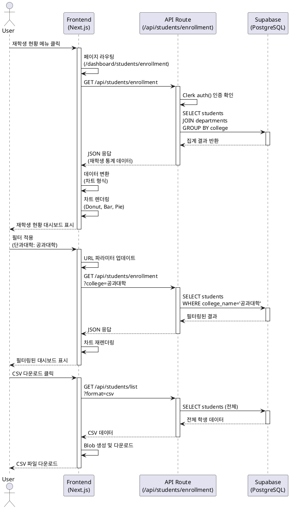

# 유스케이스 명세서: 학생 현황 및 지도교수 관리

## 유스케이스 ID: UC-006

### 제목
재학생 현황 조회 및 지도교수별 학생 관리

---

## 1. 개요

### 1.1 목적
대학 구성원(경영진, 학과장, 교수진)이 재학생 현황과 지도교수별 학생 분포를 조회하고 분석하여, 학생 관리 및 교육 운영에 필요한 의사결정을 지원합니다.

### 1.2 범위
- 재학생 현황 대시보드 조회 (단과대학별, 학과별, 과정구분별, 학적상태별)
- 지도교수별 학생 현황 조회 및 통계 분석
- 학생 목록 필터링, 정렬, 검색 기능
- 학생 데이터 CSV/Excel 다운로드

**제외 사항**:
- 학생 데이터 직접 수정/삭제 (관리자 페이지에서만 가능)
- 학생 개인정보 상세 조회 (개인정보 보호)

### 1.3 액터
- **주요 액터**: 일반 이용자 (Viewer) - 대학 경영진, 학과장, 교수진
- **부 액터**: 시스템 (데이터베이스, 인증 서비스)

---

## 2. 선행 조건

- 사용자가 Clerk를 통해 Google 계정으로 로그인한 상태
- 사용자 세션이 유효한 상태 (JWT 토큰 활성)
- students 테이블에 조회 가능한 학생 데이터가 존재
- departments 테이블에 단과대학 및 학과 정보가 존재

---

## 3. 참여 컴포넌트

### 3.1 프론트엔드
- **/dashboard/students/enrollment**: 재학생 현황 페이지 컴포넌트
- **/dashboard/students/advisors**: 지도교수별 현황 페이지 컴포넌트
- **필터 컴포넌트**: 단과대학, 학과, 과정구분, 학적상태 필터
- **차트 컴포넌트**: Donut Chart, Bar Chart, Pie Chart, Stack Bar
- **데이터 테이블 컴포넌트**: 학생 목록, 정렬/검색 기능

### 3.2 백엔드
- **API Route**: `/api/students/enrollment` - 재학생 현황 집계 API
- **API Route**: `/api/students/advisors` - 지도교수별 현황 집계 API
- **API Route**: `/api/students/list` - 학생 목록 조회 API
- **Clerk Middleware**: 인증 및 세션 검증
- **Supabase Client**: 데이터베이스 쿼리 실행

### 3.3 데이터베이스
- **students**: 학생 기본 정보 및 학적 상태
- **departments**: 단과대학 및 학과 정보

---

## 4. 기본 플로우 (Basic Flow)

### 4.1 재학생 현황 조회 플로우

#### Step 1: 페이지 접근
- **User**: 사이드바에서 "학생 현황 → 재학생 현황" 메뉴 클릭
- **FE**: `/dashboard/students/enrollment` 페이지로 라우팅
- **FE**: Clerk 인증 상태 확인

#### Step 2: 데이터 로딩
- **FE**: React Query를 사용하여 `/api/students/enrollment` API 호출
- **BE**: Clerk `auth()` 함수로 사용자 인증 확인
- **BE**: Supabase Service Role Key로 DB 연결
- **BE**: students 테이블 조회 및 집계

```sql
-- 단과대학별 재학생 수
SELECT
  d.college_name,
  COUNT(*) as student_count,
  COUNT(*) FILTER (WHERE s.program_type = '학사') as undergraduate_count,
  COUNT(*) FILTER (WHERE s.program_type = '석사') as master_count,
  COUNT(*) FILTER (WHERE s.program_type = '박사') as doctoral_count
FROM students s
JOIN departments d ON d.id = s.department_id
WHERE s.enrollment_status = '재학'
GROUP BY d.college_name;
```

- **Database**: 집계 결과 반환
- **BE**: JSON 응답 생성 및 반환

#### Step 3: 데이터 시각화
- **FE**: API 응답 데이터를 차트 데이터 형식으로 변환
- **FE**: 다음 위젯 렌더링:
  - **KPI 카드**: 총 재학생 수, 학사/석사/박사 인원
  - **도넛 차트**: 단과대학별 재학생 분포
  - **막대 그래프**: 학과별 재학생 수 (상위 20개)
  - **스택 바**: 과정구분별 현황 (학사/석사/박사)
  - **파이 차트**: 학적상태별 현황 (재학/휴학/졸업)

#### Step 4: 필터 적용
- **User**: 단과대학, 학과, 과정구분 필터 선택
- **FE**: URL 파라미터 업데이트 (`?college=공과대학&program=석사`)
- **FE**: React Query 쿼리 키 변경으로 자동 재조회
- **BE**: 필터 조건을 WHERE 절에 적용하여 쿼리 실행
- **FE**: 필터링된 데이터로 차트 재렌더링

#### Step 5: 학생 목록 조회
- **User**: 페이지 하단 학생 목록 테이블 확인
- **FE**: `/api/students/list` API 호출 (페이지네이션, 필터 포함)
- **BE**: students + departments JOIN 쿼리 실행
- **FE**: 테이블 렌더링 (학번, 이름, 학과, 학년, 과정구분, 학적상태)

### 4.2 지도교수별 현황 조회 플로우

#### Step 1: 페이지 접근
- **User**: 사이드바에서 "학생 현황 → 지도교수별 현황" 메뉴 클릭
- **FE**: `/dashboard/students/advisors` 페이지로 라우팅

#### Step 2: 데이터 집계
- **FE**: `/api/students/advisors` API 호출
- **BE**: 지도교수별 집계 쿼리 실행

```sql
-- 교수별 지도학생 수
SELECT
  advisor,
  d.department_name,
  COUNT(*) as total_students,
  COUNT(*) FILTER (WHERE program_type = '학사') as undergraduate,
  COUNT(*) FILTER (WHERE program_type = '석사') as master,
  COUNT(*) FILTER (WHERE program_type = '박사') as doctoral
FROM students s
JOIN departments d ON d.id = s.department_id
WHERE s.enrollment_status = '재학'
  AND advisor IS NOT NULL
GROUP BY advisor, d.department_name
ORDER BY total_students DESC;
```

#### Step 3: 통계 시각화
- **FE**: 다음 위젯 렌더링:
  - **KPI 카드**: 총 지도교수 수, 평균 지도학생 수, 최다 지도학생 수
  - **히스토그램**: 교수별 지도학생 수 분포
  - **스택 바**: 과정구분별 분포 (학사/석사/박사)
  - **데이터 테이블**: 교수명, 학과, 지도학생 수, 과정별 분포

#### Step 4: 교수별 학생 목록 확장
- **User**: 테이블에서 특정 교수 행 클릭
- **FE**: 확장 가능한 행 오픈
- **FE**: `/api/students/list?advisor={교수명}` API 호출
- **FE**: 해당 교수의 지도학생 목록 표시 (이름, 학번, 학과, 과정구분)

### 4.3 데이터 다운로드
- **User**: "CSV 다운로드" 또는 "Excel 다운로드" 버튼 클릭
- **FE**: 현재 필터 조건으로 전체 데이터 조회
- **FE**: CSV/XLSX 형식으로 변환
- **FE**: Blob 생성 및 다운로드 트리거
- **FE**: 파일명: `students_enrollment_20251102.csv`

### 4.4 시퀀스 다이어그램



---

## 5. 대안 플로우 (Alternative Flows)

### 5.1 교수 본인 지도학생만 조회 (교수진 액터)

**시작 조건**: 로그인한 사용자가 교수진인 경우

**단계**:
1. FE: Clerk User Metadata에서 사용자 이름 추출
2. FE: 자동으로 지도교수 필터에 본인 이름 적용
3. BE: WHERE advisor = {본인 이름} 조건 추가
4. FE: 본인 지도학생만 표시
5. FE: "본인 지도학생만 보기" 체크박스 제공 (해제 가능)

**결과**: 교수는 본인 지도학생 목록을 바로 확인 가능

---

## 6. 예외 플로우 (Exception Flows)

### 6.1 인증 실패
**발생 조건**: 사용자 세션 만료 또는 미인증 상태

**처리 방법**:
1. Clerk Middleware에서 인증 실패 감지
2. 401 Unauthorized 응답
3. 로그인 페이지로 리다이렉트
4. redirect_url 파라미터로 원래 페이지 URL 저장

**에러 코드**: `401 Unauthorized`

**사용자 메시지**: "세션이 만료되었습니다. 다시 로그인해주세요."

---

### 6.2 데이터 없음
**발생 조건**: students 테이블에 조회 가능한 데이터 없음

**처리 방법**:
1. API 응답: `{ data: [], count: 0 }`
2. FE: 빈 상태 UI 렌더링
3. 메시지 표시: "재학생 데이터가 없습니다."
4. 액션 버튼: "필터 초기화" 또는 "관리자에게 문의"

**에러 코드**: `200 OK` (정상 응답, 데이터 없음)

**사용자 메시지**: "조회된 학생 데이터가 없습니다. 필터를 조정하거나 관리자에게 문의하세요."

---

### 6.3 데이터베이스 연결 실패
**발생 조건**: Supabase 연결 오류, 네트워크 장애

**처리 방법**:
1. BE: Supabase 쿼리 실패 감지
2. 자동 재시도 (exponential backoff, 최대 3회)
3. 재시도 실패 시 500 에러 응답
4. FE: 에러 상태 UI 표시
5. "다시 시도" 버튼 제공

**에러 코드**: `500 Internal Server Error`

**사용자 메시지**: "데이터베이스 연결에 실패했습니다. 잠시 후 다시 시도해주세요."

---

### 6.4 필터 선택 결과 데이터 없음
**발생 조건**: 사용자가 선택한 필터 조건에 해당하는 데이터 없음

**처리 방법**:
1. API 응답: `{ data: [], count: 0 }`
2. FE: 빈 상태 UI 및 현재 필터 조건 표시
3. "필터 초기화" 버튼 제공
4. 사용자가 필터 조정 안내

**에러 코드**: `200 OK`

**사용자 메시지**: "선택한 조건에 해당하는 학생이 없습니다. 필터를 조정해주세요."

---

### 6.5 대용량 데이터 다운로드 시간 초과
**발생 조건**: 다운로드 데이터가 10,000건 이상

**처리 방법**:
1. FE: 다운로드 시작 전 데이터 건수 확인
2. 10,000건 이상 시 경고 모달 표시
3. 사용자 확인 후 백그라운드 다운로드 시작
4. 진행률 표시 (Progress Bar)
5. 완료 시 토스트 알림

**에러 코드**: N/A (경고 처리)

**사용자 메시지**: "대용량 데이터 다운로드는 시간이 걸릴 수 있습니다. 계속하시겠습니까?"

---

## 7. 후행 조건 (Post-conditions)

### 7.1 성공 시
- **데이터베이스 변경**: 없음 (조회 전용)
- **시스템 상태**:
  - React Query 캐시에 데이터 저장 (5분 유효)
  - 필터 설정 URL 파라미터로 저장 (공유 가능)
  - 최근 조회 기록 로컬 스토리지 저장
- **외부 시스템**:
  - Google Analytics 페이지뷰 이벤트 전송
  - CSV 다운로드 시 이벤트 트래킹

### 7.2 실패 시
- **데이터 롤백**: 해당 없음 (조회 전용)
- **시스템 상태**:
  - 에러 로그 기록 (Sentry 또는 Vercel Logs)
  - 사용자 세션 만료 시 Clerk 세션 삭제

---

## 8. 비기능 요구사항

### 8.1 성능
- **API 응답 시간**: 재학생 현황 집계 < 1초
- **페이지 로딩 시간**: 초기 페이지 로드 < 2초 (3G 네트워크)
- **동시 사용자**: 100명 동시 접속 시 성능 저하 없음
- **캐싱**: React Query 5분 캐싱으로 불필요한 API 요청 감소

### 8.2 보안
- **인증**: Clerk JWT 토큰 기반 세션 관리
- **권한**: Application Level에서 인증 확인 (Clerk auth())
- **데이터 접근**: Supabase Service Role Key 사용 (서버 사이드만)
- **개인정보 보호**: 학생 이메일, 연락처는 마스킹 처리 (선택 사항)

### 8.3 가용성
- **시스템 가동 시간**: 99.5% Uptime 목표
- **에러 복구**: 자동 재시도 로직 (API 요청 실패 시 3회)
- **Graceful Degradation**: 차트 렌더링 실패 시 테이블 뷰로 대체

---

## 9. UI/UX 요구사항

### 9.1 재학생 현황 화면 구성

#### 상단: 필터 섹션
- 단과대학 선택 (드롭다운, 다중 선택)
- 학과 선택 (드롭다운, 단과대학 선택 시 필터링)
- 과정구분 선택 (체크박스: 학사, 석사, 박사, 석박통합)
- 학적상태 선택 (체크박스: 재학, 휴학, 졸업)
- "필터 초기화" 버튼

#### 중앙: KPI 카드
- 총 재학생 수 (큰 숫자, 아이콘)
- 학사 인원 (파란색 카드)
- 석사 인원 (초록색 카드)
- 박사 인원 (주황색 카드)

#### 중앙: 차트 섹션
- **도넛 차트**: 단과대학별 재학생 분포 (중앙에 총 인원 표시)
- **막대 그래프**: 학과별 재학생 수 (상위 20개, 내림차순)
- **스택 바**: 과정구분별 현황 (학사/석사/박사 비율)
- **파이 차트**: 학적상태별 현황 (재학/휴학/졸업 비율)

#### 하단: 학생 목록 테이블
- 컬럼: 학번, 이름, 단과대학, 학과, 학년, 과정구분, 학적상태
- 페이지네이션 (50행/페이지)
- 정렬 기능 (컬럼 헤더 클릭)
- 검색 기능 (학번, 이름 검색)
- CSV/Excel 다운로드 버튼

### 9.2 지도교수별 현황 화면 구성

#### 상단: 필터 섹션
- 학과 선택 (드롭다운)
- 지도교수 검색 (텍스트 입력, 자동완성)

#### 중앙: KPI 카드
- 총 지도교수 수
- 평균 지도학생 수
- 최다 지도학생 수 (교수명 표시)

#### 중앙: 차트 섹션
- **히스토그램**: 교수별 지도학생 수 분포 (1-5명, 6-10명, 11-15명 등)
- **스택 바**: 과정구분별 분포 (학사/석사/박사)

#### 하단: 교수별 상세 테이블
- 컬럼: 교수명, 학과, 지도학생 수, 학사, 석사, 박사
- 확장 가능 행: 클릭 시 해당 교수의 지도학생 목록 표시
- 정렬 기능 (지도학생 수 내림차순 기본)

### 9.3 사용자 경험
- **로딩 상태**: 스켈레톤 로더 (차트 및 테이블 영역)
- **빈 상태**: 아이콘 + "데이터가 없습니다" 메시지 + 액션 버튼
- **에러 상태**: 에러 아이콘 + 명확한 에러 메시지 + "다시 시도" 버튼
- **성공 피드백**: 다운로드 완료 시 토스트 알림 (3초 자동 닫힘)
- **반응형 디자인**: 태블릿/모바일에서는 차트 간소화, 테이블 스크롤

---

## 10. 비즈니스 규칙 (Business Rules)

### BR-1: 재학생 정의
- `enrollment_status = '재학'`인 학생만 재학생 현황에 포함
- 휴학, 졸업, 자퇴, 제적 학생은 별도 분류

### BR-2: 지도교수 필터링
- `advisor IS NOT NULL`인 학생만 지도교수별 현황에 포함
- 지도교수 미지정 학생은 "미지정" 카테고리로 분류 (선택 사항)

### BR-3: 과정구분 분류
- 학사, 석사, 박사, 석박통합 4가지로 분류
- 기타 과정은 "기타"로 표시

### BR-4: 데이터 접근 권한
- 일반 이용자: 전체 학생 데이터 조회 가능 (읽기 전용)
- 교수진: 본인 지도학생 우선 표시 (자동 필터 적용)
- 관리자: 데이터 수정/삭제 권한 (별도 페이지)

### BR-5: 개인정보 보호
- 학생 이메일, 전화번호는 기본적으로 비공개
- 필요시 마스킹 처리 (`이메일@*****.***`)

### BR-6: 데이터 다운로드 제한
- 일반 이용자: 필터링된 데이터만 다운로드 가능
- 관리자: 전체 데이터 다운로드 가능
- 1회 다운로드 최대 10,000건 제한

---

## 11. 테스트 시나리오

### 11.1 성공 케이스

| 테스트 케이스 ID | 입력값 | 기대 결과 |
|----------------|--------|----------|
| TC-006-01 | 재학생 현황 페이지 접근 | 대시보드 정상 렌더링, KPI 카드 및 차트 표시 |
| TC-006-02 | 단과대학 필터: "공과대학" 선택 | 공과대학 소속 학생만 표시, URL 파라미터 업데이트 |
| TC-006-03 | 과정구분 필터: "석사" 선택 | 석사 과정 학생만 표시, 차트 업데이트 |
| TC-006-04 | 지도교수별 현황 페이지 접근 | 교수별 통계 표시, 히스토그램 렌더링 |
| TC-006-05 | 교수 행 클릭 | 확장 가능 행 오픈, 지도학생 목록 표시 |
| TC-006-06 | CSV 다운로드 클릭 | CSV 파일 다운로드, 파일명 형식 확인 |

### 11.2 실패 케이스

| 테스트 케이스 ID | 입력값 | 기대 결과 |
|----------------|--------|----------|
| TC-006-07 | 세션 만료 상태에서 페이지 접근 | 401 에러, 로그인 페이지로 리다이렉트 |
| TC-006-08 | 존재하지 않는 단과대학 필터 | 빈 상태 UI, "데이터가 없습니다" 메시지 |
| TC-006-09 | DB 연결 실패 | 500 에러, "다시 시도" 버튼 표시 |
| TC-006-10 | 10,000건 이상 다운로드 시도 | 경고 모달, 사용자 확인 후 진행 |

---

## 12. 관련 유스케이스

### 선행 유스케이스
- **UC-001: Google 로그인** - 사용자 인증 필수
- **UC-005: 데이터 업로드 및 적재** - 학생 데이터 사전 적재 필요

### 후행 유스케이스
- **UC-007: 데이터 다운로드** - 학생 목록 CSV/Excel 다운로드
- **UC-008: 리포트 생성** - 학생 현황 PDF 리포트 생성 (향후)

### 연관 유스케이스
- **UC-002: 메인 대시보드** - 전체 재학생 수 KPI 표시
- **UC-003: 학과 성과 관리** - 학과별 학생 수 연계

---

## 13. 변경 이력

| 버전 | 날짜 | 작성자 | 변경 내용 |
|------|------|--------|-----------|
| 1.0  | 2025-11-02 | AI Assistant | 초기 작성 |

---

## 부록

### A. 용어 정의

| 용어 | 정의 |
|------|------|
| 재학생 | enrollment_status가 '재학'인 학생 |
| 과정구분 | 학사, 석사, 박사, 석박통합 등 학위 과정 분류 |
| 학적상태 | 재학, 휴학, 졸업, 자퇴, 제적 등 학생 상태 |
| 지도교수 | 학생의 학업 및 연구를 지도하는 교수 |
| KPI 카드 | 핵심 지표를 한눈에 보여주는 대시보드 위젯 |

### B. 참고 자료

- **PRD**: `/docs/prd.md` - 5. 학생 현황 (Student Management)
- **Userflow**: `/docs/userflow.md` - 6.3 학생 현황, 6.4 지도교수별 현황
- **Database**: `/docs/database.md` - students 테이블, departments 테이블
- **Clerk 인증 가이드**: `/docs/external/clerk.md`

### C. API 엔드포인트 명세 (참고)

#### GET /api/students/enrollment
**쿼리 파라미터**:
- `college` (optional): 단과대학명
- `department` (optional): 학과명
- `program_type` (optional): 과정구분
- `enrollment_status` (optional): 학적상태

**응답 예시**:
```json
{
  "summary": {
    "total_students": 8456,
    "undergraduate": 6234,
    "master": 1567,
    "doctoral": 655
  },
  "by_college": [
    {
      "college_name": "공과대학",
      "student_count": 2500,
      "undergraduate": 1800,
      "master": 500,
      "doctoral": 200
    }
  ],
  "by_department": [
    {
      "department_name": "컴퓨터공학과",
      "student_count": 350
    }
  ]
}
```

#### GET /api/students/advisors
**쿼리 파라미터**:
- `department` (optional): 학과명
- `advisor` (optional): 지도교수명

**응답 예시**:
```json
{
  "summary": {
    "total_advisors": 234,
    "avg_students_per_advisor": 6.2,
    "max_students": 15
  },
  "advisors": [
    {
      "advisor_name": "김철수",
      "department_name": "컴퓨터공학과",
      "total_students": 12,
      "undergraduate": 4,
      "master": 6,
      "doctoral": 2
    }
  ]
}
```

---

**문서 종료**
