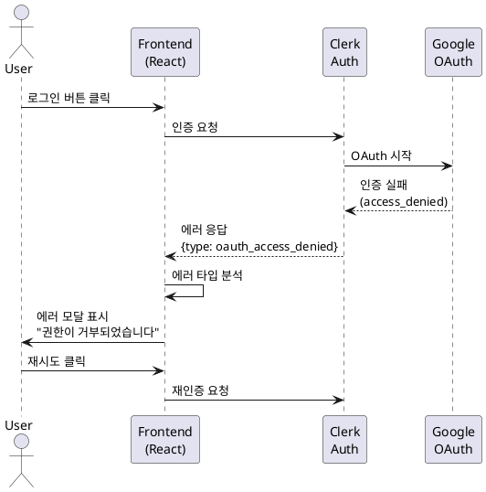
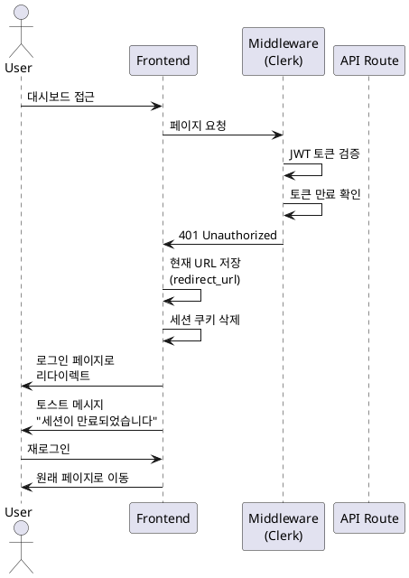
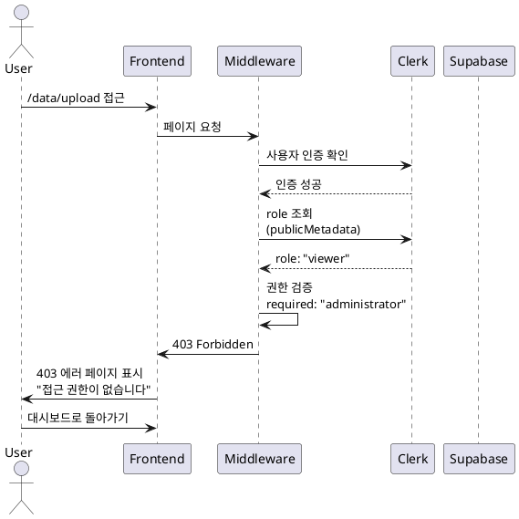
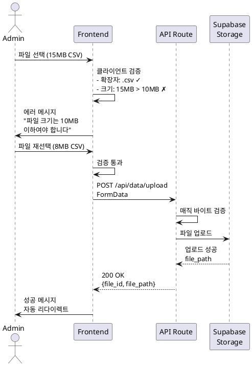
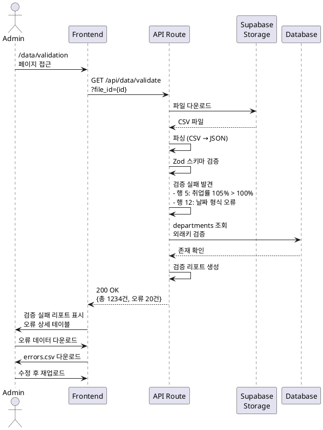
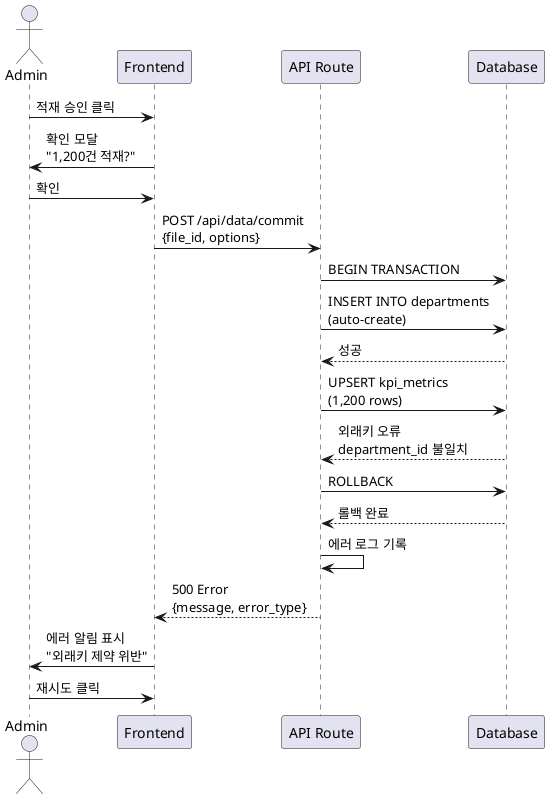
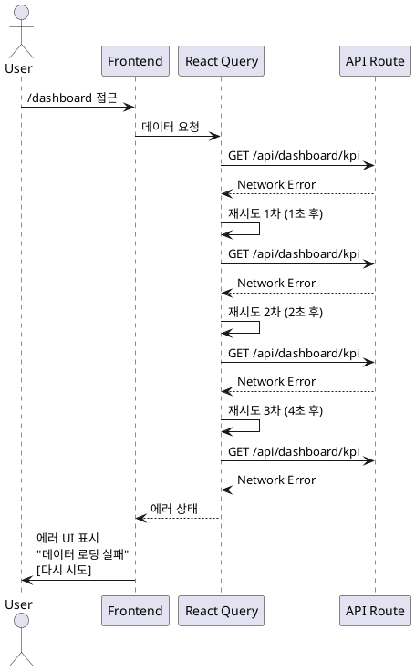
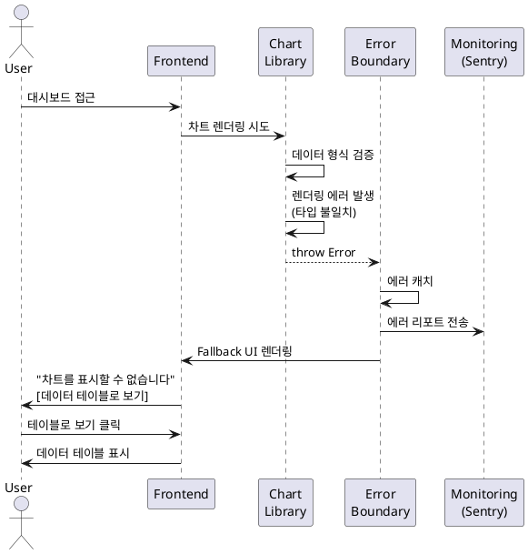
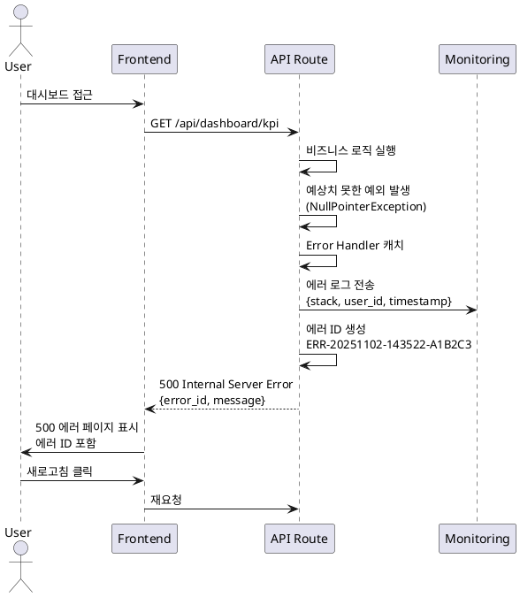
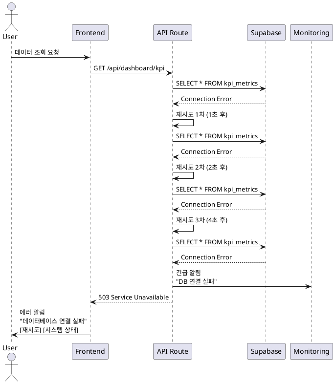

# 유스케이스 명세: 에러 핸들링 및 예외 상황 처리

**유스케이스 ID:** UC-007
**작성일:** 2025-11-02
**버전:** 1.0
**우선순위:** High

---

## 1. 개요

### 1.1 목적
시스템 운영 중 발생할 수 있는 다양한 에러 및 예외 상황을 적절히 처리하여 사용자에게 명확한 피드백을 제공하고, 시스템 안정성을 확보하며, 데이터 무결성을 보장합니다.

### 1.2 범위
- 인증 관련 에러 (로그인 실패, 세션 만료, 권한 부족)
- 데이터 관련 에러 (파일 업로드, 데이터 검증, DB 적재)
- UI/UX 에러 (페이지 로딩, 차트 렌더링, 네트워크)
- 시스템 에러 (서버 오류, 데이터베이스 연결 실패)
- 에러 복구 전략 (자동 재시도, 사용자 피드백, 에러 로깅)

### 1.3 액터
- **주요 액터**: 시스템 사용자 (관리자, 이용자)
- **부 액터**: Next.js Application, Clerk, Supabase, 모니터링 시스템

---

## 2. 선행 조건

- Next.js 15 애플리케이션이 정상 배포되어 있음
- Clerk 인증 시스템이 구성되어 있음
- Supabase 데이터베이스가 활성화되어 있음
- React Query (TanStack Query) 캐싱이 설정되어 있음
- Error Boundary가 구현되어 있음

---

## 3. 참여 컴포넌트

- **클라이언트 (React)**: 에러 UI 표시, Error Boundary, 사용자 피드백
- **Middleware**: Clerk 인증 검증, 권한 확인
- **API Routes**: 비즈니스 로직 에러 처리, 데이터 검증
- **Clerk**: 인증 에러 관리
- **Supabase**: 데이터베이스 에러 처리, 트랜잭션 롤백
- **React Query**: 네트워크 에러 재시도, 캐시 관리
- **모니터링**: 에러 로그 수집 및 알림

---

## 4. 에러 카테고리별 처리

### 4.1 인증 관련 에러

#### 4.1.1 로그인 실패 (UC-007-AUTH-001)

**Primary Actor:** 사용자
**Precondition:** 사용자가 로그인을 시도함

**Trigger:**
- Google OAuth 인증 실패
- 사용자가 권한 거부
- 네트워크 연결 문제

**Main Scenario:**
1. 사용자가 "Google로 로그인" 버튼 클릭
2. Clerk OAuth 프로세스 시작
3. Google 인증 화면에서 에러 발생
4. Clerk가 에러를 감지하고 에러 타입 분류
   - `oauth_access_denied`: 사용자가 권한 거부
   - `network_error`: 네트워크 연결 문제
   - `invalid_credentials`: 인증 정보 오류
5. 클라이언트에서 에러를 수신하고 에러 모달 표시
6. 사용자에게 에러 원인과 해결 방법 안내
7. "재시도" 및 "취소" 옵션 제공

**Edge Cases:**
- Google 서비스 다운타임: 시스템 상태 확인 링크 제공
- 반복적인 실패: 임시 잠금 및 관리자 문의 안내
- 브라우저 쿠키 차단: 쿠키 설정 안내

**Business Rules:**
- 사용자에게 명확한 에러 메시지 제공
- 에러 로그에 민감 정보 기록 금지
- 3회 이상 실패 시 임시 잠금 (5분)

**PlantUML Sequence Diagram:**


---

#### 4.1.2 세션 만료 (UC-007-AUTH-002)

**Primary Actor:** 인증된 사용자
**Precondition:** 사용자가 로그인 상태로 시스템 사용 중

**Trigger:**
- JWT 토큰 유효기간 초과 (7일 기본, 30일 Remember Me)
- 사용자 장시간 비활성

**Main Scenario:**
1. 사용자가 대시보드 페이지 접근 또는 API 요청
2. Clerk Middleware에서 JWT 토큰 검증
3. 토큰 만료 확인 (401 Unauthorized)
4. 현재 페이지 URL을 redirect_url로 저장
5. 세션 쿠키 삭제
6. 로그인 페이지로 리다이렉트
7. "세션이 만료되었습니다. 다시 로그인해주세요" 토스트 메시지 표시
8. 로그인 완료 후 저장된 URL로 자동 리다이렉트

**Edge Cases:**
- API 요청 중 세션 만료: 진행 중인 작업 상태 저장 및 복구
- 여러 탭에서 동시 세션: BroadcastChannel API로 동기화

**Business Rules:**
- 세션 만료 24시간 전에 갱신 알림 제공 (선택사항)
- 중요 작업 중 세션 만료 시 임시 저장 기능 제공
- 재로그인 시 원래 페이지로 자동 이동

**PlantUML Sequence Diagram:**


---

#### 4.1.3 권한 부족 (UC-007-AUTH-003)

**Primary Actor:** 일반 사용자
**Precondition:** 사용자가 로그인되어 있음

**Trigger:**
- 일반 사용자가 관리자 전용 페이지 접근 시도 (/data/*)
- 역할 정보 불일치

**Main Scenario:**
1. 사용자가 데이터 관리 페이지 URL 직접 입력 또는 링크 클릭
2. Middleware에서 사용자 인증 확인 (통과)
3. Middleware 또는 페이지 컴포넌트에서 사용자 role 조회
   - Clerk publicMetadata에서 role 확인
   - 또는 Supabase users 테이블에서 조회
4. role !== 'administrator' 확인
5. 403 Forbidden 에러 페이지 렌더링
6. "접근 권한이 없습니다" 메시지 표시
7. "대시보드로 돌아가기" 버튼 제공

**Edge Cases:**
- role 정보 없음: 기본값 'viewer'로 처리
- Clerk와 Supabase 간 role 불일치: 동기화 시도 후 Clerk 우선

**Business Rules:**
- 관리자 페이지는 Sidebar에서 일반 사용자에게 숨김
- 권한 없는 접근 시도 로그 기록
- 반복적인 무단 접근 시 보안팀 알림

**PlantUML Sequence Diagram:**


---

### 4.2 데이터 관련 에러

#### 4.2.1 파일 업로드 실패 (UC-007-DATA-001)

**Primary Actor:** 관리자
**Precondition:** 관리자가 데이터 업로드 페이지에 접근함

**Trigger:**
- 파일 크기 초과 (>10MB)
- 잘못된 파일 형식 (CSV, XLSX 외)
- 네트워크 오류
- Supabase Storage 용량 부족

**Main Scenario:**
1. 관리자가 CSV 파일을 드래그 앤 드롭 또는 선택
2. 클라이언트에서 파일 검증
   - 파일 확장자 확인 (.csv, .xlsx)
   - 파일 크기 확인 (최대 10MB)
   - MIME 타입 확인
3. 검증 실패 시:
   - 업로드 차단
   - 에러 메시지 표시
   - 파일 크기 초과: "파일 크기는 10MB 이하여야 합니다. (현재: 15.3MB)"
   - 형식 오류: "CSV 또는 XLSX 파일만 업로드 가능합니다."
4. 검증 성공 시 서버로 업로드
5. 서버에서 추가 검증 (매직 바이트)
6. Supabase Storage 업로드 시도
7. 오류 발생 시:
   - 네트워크 오류: "네트워크 연결을 확인해주세요"
   - Storage 부족: "저장 공간이 부족합니다. 관리자에게 문의하세요"
8. "다시 시도" 및 "취소" 버튼 제공

**Edge Cases:**
- 동시 다중 파일 업로드: 순차 처리 또는 배치 업로드
- 업로드 중 네트워크 끊김: 청크 업로드 및 재개 기능

**Business Rules:**
- 파일 크기 제한: 10MB
- 허용 형식: CSV, XLSX만
- 업로드 실패 시 임시 파일 즉시 삭제

**PlantUML Sequence Diagram:**


---

#### 4.2.2 데이터 검증 실패 (UC-007-DATA-002)

**Primary Actor:** 관리자
**Precondition:** CSV 파일이 업로드되어 검증 페이지로 이동함

**Trigger:**
- 필수 필드 누락
- 데이터 타입 불일치
- 범위 초과 값
- 외래키 참조 오류

**Main Scenario:**
1. 업로드된 파일을 Supabase Storage에서 다운로드
2. CSV/XLSX 파일을 JSON으로 파싱
3. Zod 스키마로 각 행 검증
   - 필수 필드 존재 확인
   - 데이터 타입 검증 (Number, String, Date, Boolean)
   - 날짜 형식 검증 (YYYY-MM-DD)
   - 숫자 범위 검증 (취업률: 0-100%, 교원 수: 음수 불가)
4. 중복 데이터 검사 (고유 식별자 기준)
5. 외래키 참조 무결성 검증 (단과대학명, 학과명)
6. 검증 결과 리포트 생성
   - 총 레코드 수
   - 유효 레코드 수
   - 오류 레코드 수 및 상세 내역
   - 경고 레코드 수 (중복)
7. 오류 발견 시:
   - 오류 상세 테이블 표시
   - 행 번호, 필드명, 오류 메시지, 현재 값
   - "오류 데이터 다운로드" 버튼 (CSV)
   - "수정 후 재업로드" 버튼
   - 적재 버튼 비활성화
8. 데이터 미리보기 렌더링 (최대 100행)
   - 오류 행: 빨간색 하이라이트
   - 경고 행: 노란색 하이라이트

**Edge Cases:**
- 전체 행 오류: "모든 데이터가 유효하지 않습니다" 경고
- 필수 컬럼 누락: "필수 컬럼이 누락되었습니다: [컬럼명]" 에러
- 인코딩 오류 (한글 깨짐): UTF-8 인코딩 안내
- 대용량 파일 (>10,000행): 배치 검증 (청킹)

**Business Rules:**
- 오류 레코드가 1개라도 있으면 적재 불가
- 경고 레코드는 사용자 선택에 따라 처리
- 검증 결과는 upload_logs 테이블에 저장

**PlantUML Sequence Diagram:**


---

#### 4.2.3 DB 적재 실패 (UC-007-DATA-003)

**Primary Actor:** 관리자
**Precondition:** 데이터 검증을 통과하고 적재 승인을 클릭함

**Trigger:**
- 외래키 제약 위반
- 트랜잭션 타임아웃
- 데이터베이스 연결 오류
- 중복 키 충돌

**Main Scenario:**
1. 관리자가 "적재 승인" 버튼 클릭
2. 확인 모달 표시: "1,200건의 데이터를 적재하시겠습니까?"
3. 확인 클릭 시 Supabase 트랜잭션 시작
4. 데이터 타입별 적재 로직 실행
   - departments 자동 생성/업데이트
   - 메인 테이블 Upsert (ON CONFLICT)
5. 트랜잭션 중 에러 발생
   - 외래키 오류: "존재하지 않는 학과명이 포함되어 있습니다: [목록]"
   - 타임아웃: "처리 시간이 초과되었습니다. 데이터를 분할하여 업로드해주세요."
   - 연결 오류: "데이터베이스 연결에 실패했습니다. 잠시 후 다시 시도해주세요."
6. 자동 롤백 실행
7. 에러 로그 기록
8. 에러 알림 표시
9. "재시도" 및 "관리자 문의" 버튼 제공

**Edge Cases:**
- 부분 적재 성공 후 실패: 트랜잭션 롤백으로 전체 취소
- 네트워크 파티셔닝: Connection pool 재연결 시도

**Business Rules:**
- 트랜잭션 실패 시 100% 롤백 보장
- 에러 발생 시 upload_logs 테이블에 상태 기록 (failed)
- 임시 파일은 실패 시에도 7일 보관 (재시도 용)

**PlantUML Sequence Diagram:**


---

### 4.3 UI/UX 에러

#### 4.3.1 페이지 로딩 실패 (UC-007-UI-001)

**Primary Actor:** 사용자
**Precondition:** 사용자가 페이지 접근 시도

**Trigger:**
- 존재하지 않는 페이지 접근 (404)
- API 요청 실패 (네트워크 오류)
- 데이터 로딩 타임아웃

**Main Scenario:**
1. 사용자가 URL 입력 또는 링크 클릭
2. Next.js 라우팅 처리
3. 404 또는 데이터 로딩 실패 감지
4. 404 에러:
   - 404 에러 페이지 렌더링
   - "페이지를 찾을 수 없습니다" 메시지
   - "홈으로 가기", "대시보드", "뒤로 가기" 버튼
5. 데이터 로딩 실패:
   - React Query 자동 재시도 (최대 3회, 지수 백오프)
   - 재시도 실패 시 에러 UI 표시
   - "데이터 로딩 실패" 메시지
   - "다시 시도" 버튼

**Edge Cases:**
- 네트워크 완전 끊김: 오프라인 상태 감지 및 안내
- 서버 다운타임: 시스템 상태 페이지 링크

**Business Rules:**
- 자동 재시도 간격: 1초, 2초, 4초 (지수 백오프)
- 최대 재시도 횟수: 3회
- 재시도 실패 시 캐시된 데이터 표시 (가능한 경우)

**PlantUML Sequence Diagram:**


---

#### 4.3.2 차트 렌더링 실패 (UC-007-UI-002)

**Primary Actor:** 사용자
**Precondition:** 사용자가 대시보드 페이지를 정상적으로 로드함

**Trigger:**
- 차트 라이브러리 에러
- 데이터 형식 불일치
- 브라우저 호환성 문제

**Main Scenario:**
1. 대시보드 페이지 렌더링 중 차트 컴포넌트 로드
2. 차트 라이브러리 초기화 시도
3. 렌더링 에러 발생
4. Error Boundary에서 에러 캐치
5. 에러 로그 기록 (Sentry 등)
6. Fallback UI 표시
   - "차트를 표시할 수 없습니다"
   - "데이터는 정상이지만 차트 렌더링에 실패했습니다"
   - "데이터 테이블로 보기" 버튼 (대체 뷰)
   - "문제 신고" 버튼

**Edge Cases:**
- 부분 차트만 실패: 실패한 차트만 Fallback, 나머지 정상 표시
- 데이터 없음: 빈 상태 UI와 에러 UI 구분

**Business Rules:**
- 차트 렌더링 에러는 전체 페이지를 막지 않음
- 에러 발생 시 대체 뷰 제공 (테이블 형식)
- 에러 리포트를 모니터링 시스템에 자동 전송

**PlantUML Sequence Diagram:**


---

### 4.4 시스템 에러

#### 4.4.1 서버 에러 (UC-007-SYS-001)

**Primary Actor:** 사용자
**Precondition:** 사용자가 시스템을 정상적으로 사용 중

**Trigger:**
- API Route 내부 예외 발생
- 예상치 못한 서버 오류

**Main Scenario:**
1. 사용자가 API 요청 (예: 대시보드 데이터 조회)
2. API Route에서 비즈니스 로직 실행 중 예외 발생
3. Error Handler에서 예외 캐치
4. 에러 로그 기록
   - Vercel Logs
   - Sentry (선택사항)
   - 에러 스택 트레이스
   - 사용자 컨텍스트 (user_id, page, action)
5. 500 Internal Server Error 응답 반환
6. 클라이언트에서 500 에러 감지
7. 500 에러 페이지 렌더링
   - "서버 오류가 발생했습니다"
   - "일시적인 문제가 발생했습니다. 잠시 후 다시 시도해주세요."
   - "문제가 지속되면 관리자에게 문의하세요."
   - "에러 ID: ERR-20251102-143522-A1B2C3"
   - "새로고침" 버튼
   - "관리자 문의" 버튼

**Edge Cases:**
- 반복적인 500 에러: 자동 롤백 및 안전 모드 전환
- 전체 시스템 다운: 정적 에러 페이지 표시

**Business Rules:**
- 에러 ID는 timestamp + random hash로 생성
- 민감 정보는 에러 메시지에 포함하지 않음
- 에러 발생 시 즉시 모니터링 팀에 알림

**PlantUML Sequence Diagram:**


---

#### 4.4.2 데이터베이스 연결 실패 (UC-007-SYS-002)

**Primary Actor:** 사용자
**Precondition:** 사용자가 데이터 조회 시도

**Trigger:**
- Supabase 다운타임
- 네트워크 파티셔닝
- Connection Pool 고갈

**Main Scenario:**
1. API Route에서 Supabase 쿼리 실행 시도
2. 데이터베이스 연결 실패 감지
3. 재시도 로직 실행 (exponential backoff)
   - 1차 재시도 (1초 후)
   - 2차 재시도 (2초 후)
   - 3차 재시도 (4초 후)
4. 재시도 모두 실패
5. 에러 로그 기록
6. 클라이언트에게 에러 응답
7. 에러 알림 표시
   - "데이터베이스 연결 실패"
   - "데이터베이스에 연결할 수 없습니다."
   - "네트워크 상태를 확인하거나 잠시 후 다시 시도해주세요."
   - "재시도" 버튼
   - "시스템 상태 확인" 링크

**Edge Cases:**
- 장시간 다운타임: 캐시된 데이터로 읽기 전용 모드 제공
- 부분 서비스 가능: 에러 발생한 테이블만 제외하고 나머지 표시

**Business Rules:**
- 자동 재시도 간격: 1초, 2초, 4초
- 최대 재시도: 3회
- 연결 실패 시 모니터링 시스템에 긴급 알림

**PlantUML Sequence Diagram:**


---

## 5. 에러 복구 전략

### 5.1 자동 재시도 (Auto-Retry)

**적용 대상:**
- API 요청 실패 (네트워크 오류)
- 데이터베이스 연결 실패
- 일시적인 서비스 오류

**재시도 정책:**
- React Query 기본 설정
  - 재시도 횟수: 3회
  - 재시도 간격: 지수 백오프 (1초, 2초, 4초)
  - staleTime: 5분
  - cacheTime: 10분

**예외:**
- 4xx 클라이언트 에러: 재시도 안 함
- 인증 에러 (401, 403): 재시도 안 함

---

### 5.2 에러 로깅 (Error Logging)

**로깅 대상:**
- 모든 서버 사이드 에러 (500번대)
- 인증 실패 시도
- 데이터 검증 실패
- 데이터베이스 에러

**로깅 정보:**
```typescript
{
  timestamp: "2025-11-02T14:35:22Z",
  error_id: "ERR-20251102-143522-A1B2C3",
  error_type: "DatabaseConnectionError",
  message: "Connection to Supabase failed",
  stack_trace: "...",
  user_context: {
    user_id: "user_2abc123",
    email: "admin@university.edu",
    page: "/dashboard",
    action: "fetch_kpi_data"
  },
  environment: "production",
  severity: "critical"
}
```

**로깅 도구:**
- Vercel Logs (기본)
- Sentry (선택사항, 프로덕션)

---

### 5.3 사용자 피드백 (User Feedback)

**원칙:**
- 명확한 에러 메시지 제공
- 해결 방법 안내
- 재시도 옵션 제공
- 관리자 문의 경로 제공

**에러 메시지 가이드라인:**
- 기술 용어 최소화
- 사용자가 이해할 수 있는 언어 사용
- 구체적인 해결 방법 제시
- 에러 ID 제공 (문의 시 사용)

---

### 5.4 Graceful Degradation

**전략:**
- 차트 렌더링 실패 시 데이터 테이블 제공
- 일부 데이터 로딩 실패 시 사용 가능한 데이터만 표시
- 오프라인 상태 감지 및 캐시된 데이터 표시
- 관리자 기능 실패 시 읽기 전용 모드 제공

---

## 6. 비기능 요구사항

### 6.1 성능
- 에러 페이지 로딩: <500ms
- 에러 로그 전송: 비동기 (사용자 경험 차단 안 함)
- 재시도 최대 지연: 7초 (1+2+4)

### 6.2 보안
- 에러 메시지에 민감 정보 포함 금지 (DB 스키마, 키 등)
- 에러 로그에 개인정보 최소화
- 에러 ID를 통한 간접 참조

### 6.3 가용성
- 에러 발생 시에도 시스템 전체 다운 방지
- 부분 서비스 유지
- 모니터링 및 알림 시스템 24/7 운영

---

## 7. UI/UX 요구사항

### 7.1 에러 표시 방식

**토스트 (Toast)**
- 용도: 일시적 알림 (성공, 경고, 정보)
- 표시 시간: 3초 자동 닫힘
- 위치: 화면 우측 상단

**모달 (Modal)**
- 용도: 중요한 에러, 확인 필요
- 사용자 액션 필요: 확인, 취소
- 배경 어둡게 처리 (overlay)

**인라인 에러**
- 용도: 폼 필드 검증 에러
- 위치: 해당 필드 바로 아래
- 색상: 빨간색

**에러 페이지**
- 용도: 404, 403, 500 등 페이지 수준 에러
- 전체 화면 표시
- 홈으로 돌아가기, 재시도 버튼 제공

### 7.2 로딩 상태

**스켈레톤 로더**
- 차트 및 테이블 영역에 표시
- 실제 콘텐츠 구조와 유사한 형태

**스피너**
- 버튼 클릭 후 처리 중
- 크기: 작은 인라인 스피너

**프로그레스 바**
- 파일 업로드, 데이터 적재
- 진행률 표시 (0-100%)

---

## 8. 테스트 시나리오

### 8.1 성공 케이스

| 테스트 케이스 ID | 시나리오 | 기대 결과 |
|----------------|---------|----------|
| TC-007-01 | 네트워크 일시 오류 후 재시도 성공 | 데이터 정상 로드, 사용자 인지 없음 |
| TC-007-02 | 파일 크기 초과 검증 | 에러 메시지 표시, 업로드 차단 |
| TC-007-03 | 세션 만료 후 재로그인 | 원래 페이지로 자동 리다이렉트 |

### 8.2 실패 케이스

| 테스트 케이스 ID | 시나리오 | 기대 결과 |
|----------------|---------|----------|
| TC-007-04 | 3회 재시도 모두 실패 | 에러 UI 표시, 재시도 버튼 제공 |
| TC-007-05 | DB 트랜잭션 실패 | 자동 롤백, 에러 로그 기록 |
| TC-007-06 | 관리자 페이지 무단 접근 | 403 에러 페이지, 접근 로그 기록 |

---

## 9. 관련 유스케이스

- **UC-001**: 사용자 인증 및 로그인 (인증 에러 처리와 연계)
- **UC-006**: 데이터 관리 (파일 업로드, 검증, 적재 에러 처리)
- **UC-002~005**: 대시보드 조회 (데이터 로딩, 차트 렌더링 에러 처리)

---

## 10. 변경 이력

| 버전 | 날짜 | 작성자 | 변경 내용 |
|------|------|--------|-----------|
| 1.0 | 2025-11-02 | AI Assistant | 초기 작성 |

---

## 부록

### A. 용어 정의

- **Error Boundary**: React 컴포넌트 트리에서 에러를 캐치하는 컴포넌트
- **Exponential Backoff**: 재시도 간격을 지수적으로 증가시키는 전략
- **Graceful Degradation**: 시스템 일부 실패 시에도 나머지 기능 제공
- **RLS (Row Level Security)**: Supabase의 행 수준 보안 정책

### B. 참고 자료

- [Clerk Error Handling](https://clerk.com/docs/errors)
- [Supabase Error Handling](https://supabase.com/docs/guides/database/errors)
- [React Query Error Handling](https://tanstack.com/query/latest/docs/react/guides/query-retries)
- [Next.js Error Handling](https://nextjs.org/docs/app/building-your-application/routing/error-handling)

---

**문서 종료**
